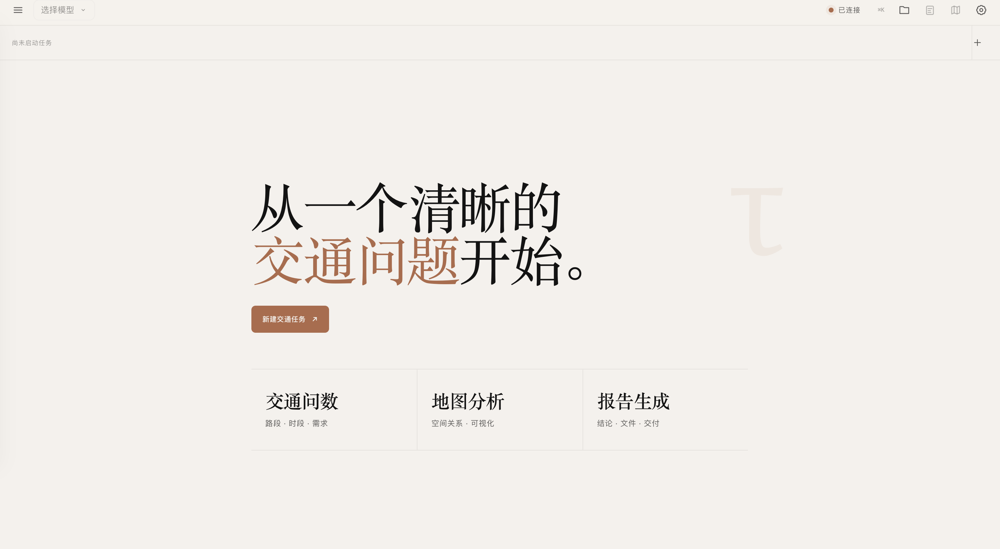
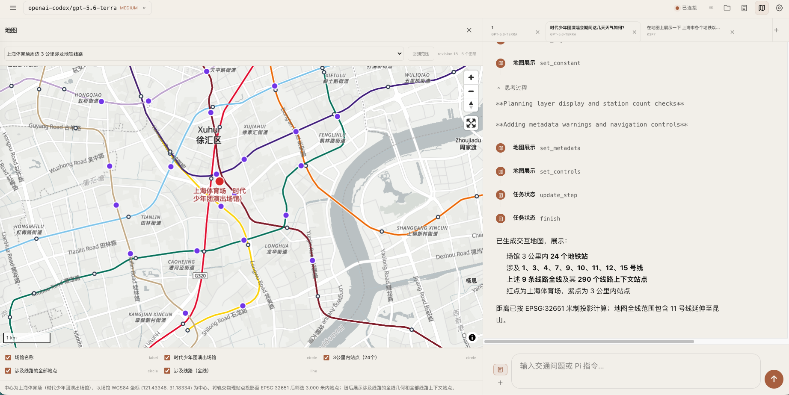
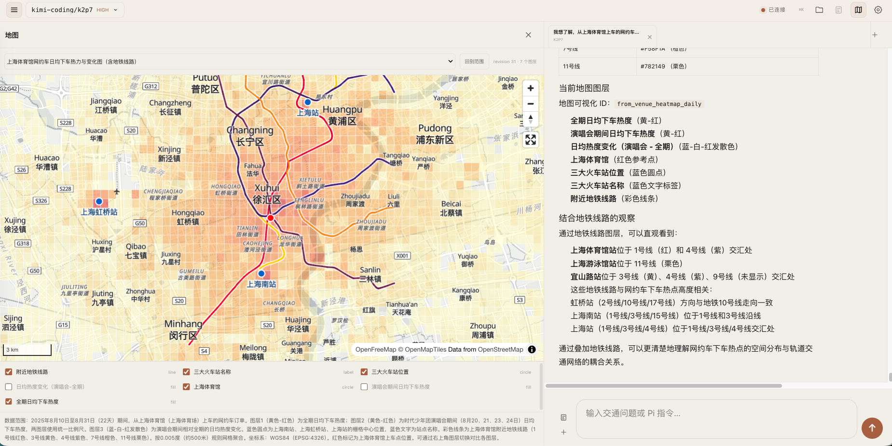

# TransportX Traffic Agent

可安装的本地交通分析 Agent。Electron 负责桌面生命周期，Node Agent Host 管理 Pi RPC、Python、会话与文件，现有 React Workspace 展示结构化任务、引用、报告和地图结果。

项目采用单仓库、模块化单体：Pi Extension 负责产生受控数据，Node 服务负责会话与资源边界，React 负责交互和展示。当前没有第二套 Web UI 或回退入口。

## 能做什么

- 创建、切换、恢复和关闭多个 Pi RPC 任务；历史会话按最后一次对话时间排序。
- 展示流式回复、思考过程、工具执行与上下文状态。
- 用 `tau_task` 与 `tau_ask_user` 管理任务步骤和用户交互。
- 按会话浏览并预览代码、表格、Markdown 报告和图片；自动汇总本次产出，Markdown 报告可直接渲染并下载为 PDF。
- 在回答中使用可核查的知识库引用，并在消息与 Markdown 报告末尾按正文序号自动生成引用依据。
- 发布受会话目录约束的 GeoJSON，并按需加载 MapLibre 地图。

## 界面示意

首页提供交通问数、地图分析和报告生成入口：



Agent 可在同一工作台中完成 GIS 分析、地图增量编辑和结果说明。下图展示上海体育场周边地铁线路、站点与工具执行过程：



地图可以叠加交通需求热力、重要场站标签和地铁线路，并在右侧保留分析说明：



## 快速开始

```bash
npm install
./start.sh
```

默认地址：<http://127.0.0.1:3000>。

也可手动构建并启动：

```bash
npm run build
node bin/tau.js --host 127.0.0.1 --port 3001 --open
```

开发 React 页面时，另开终端运行：

```bash
npm run dev:web
```

它会代理 API 和 WebSocket 到 `127.0.0.1:3000`。

## 桌面应用

开发模式直接启动 Electron 与本地 Agent Host：

```bash
npm run desktop:dev
```

macOS 首次启动会创建 `~/.transportx/traffic-agent/`。任务工作目录统一位于 `scenario/`，Pi 的 `models.json`、`auth.json`、会话、日志和缓存也都保存在该应用目录下。应用不会预设模型；请在“新建交通任务”或“设置”中点击“添加模型”，填写 Pi 兼容的供应商、模型、API 协议和密钥后再创建任务。

设置页以 Module 为唯一安装单元。一个 Module 可以同时包含 Skill、Extension、Data 和 Knowledge；安装时填写包含 `manifest.json` 的模块目录，内容会复制到 `~/.transportx/traffic-agent/modules/<module-id>/<version>/`。用户模块需显式启用后才会进入新任务；卸载只删除该受管副本，内置模块不可卸载。Agent 对话中的 `create-transportx-module` 官方 Skill 可按用户意图创建模块包。

平台内置模块只提供 Workbench、Task、Geo、Citation、Web Bridge 等通用应用与功能能力。仓库中的用户模块源码位于 `modules/installable/`：`shanghaidata` 负责上海数据及其口径，`traffic-assurance-knowledge` 负责交通保障知识，`plot-style` 负责可替换的绘图经验与风格。它们不会进入桌面应用安装包，也不属于平台启动依赖。

制作安装包前，需要准备对应平台的可重定位 Python 3.10 运行时，并按 `desktop/python-requirements.txt` 安装运行依赖。构建脚本会在复制后检查 Python 版本、CPU 架构、目录可重定位性和必要模块；普通 Conda 环境不能直接作为发布运行时。Pi CLI 与 Node/Electron 版本已由项目锁定。

正式 macOS 发布还必须配置 Developer ID Application 证书，以及 Apple ID、App Store Connect API Key 或 keychain profile 三种公证凭据之一：

```bash
TRANSPORTX_PYTHON_RUNTIME_DIR=/absolute/path/to/python-runtime npm run desktop:pack
```

`desktop:pack` 在缺少签名或公证凭据时会直接停止，避免误发未签名 DMG。仅做本机结构验收时可显式设置 `TRANSPORTX_ALLOW_UNSIGNED_BUILD=1`。macOS 目标为 macOS 12 及以上的 Apple Silicon DMG。

Windows 10/11 x64 使用原生 Windows 主机制作 NSIS 安装包：准备可重定位 Python 3.10 x64 runtime 与包含 `ffmpeg.exe`/`ffprobe.exe` 的 runtime，设置 `TRANSPORTX_PYTHON_RUNTIME_DIR`、`TRANSPORTX_FFMPEG_RUNTIME_DIR` 与 Authenticode 证书变量后运行 `npm run desktop:pack`。`npm run test:platform:windows` 会实际静默安装、启动、卸载，并验证用户数据保留。完整命令、签名和人工验收要求见 [Windows 发行指南](docs/WINDOWS_RELEASE.md)。

交通知识库和数据库作为大体积 Module Asset，不写入应用安装包，也不放在 Skill 相邻目录。Knowledge Module 必须同时保存原始 PDF/文档、检索索引和精确定位映射，Citation 才能打开原始来源。运行时从已启用 Module 的安装清单解析资产，并分别向相关工具提供 `TRANSPORTX_KNOWLEDGE_ROOT` 与 `TRANSPORTX_TRAFFIC_DATA_ROOT`。

## 验证

```bash
npm run typecheck
npm test
npm run test:web
npm run test:platform:macos
npm run test:platform:windows
npm run test:pi-smoke
```

- `npm test`：核心 Agent Host 场景：启动桌面会话宿主、创建任务环境、安装/卸载 Module，并确认健康检查与进程退出。
- `test:web`：真实 Node 服务、fake Pi 和 Chrome 的 React 工作台功能冒烟。
- `test:platform:macos`：真实 Electron、Agent Host 和 fake Pi 的 macOS 生命周期、内置 Python、PDF 导出、安全选项与退出清理冒烟；设置 `TRANSPORTX_PACKAGED_APP` 后可直接验证构建出的 `.app`。
- `test:platform:windows`：Windows x64 未安装应用或 NSIS 安装器的启动验证；安装器场景额外验证静默安装、卸载与用户数据保留。
- `test:pi-smoke`：真实本机 Pi RPC 离线冒烟；它会启动子进程，不纳入默认测试。

`bin/`、`public/*.js`、`public/geo-runtime.*` 和 `dist/web/` 都是本地生成物，不手工编辑或提交。

## 运行约束

- 桌面安装包使用内置 Pi CLI 与 Python；Web 开发模式仍可通过环境变量覆盖运行时。不要用 `sudo` 启动。
- macOS 新建任务默认位于 `~/.transportx/traffic-agent/scenario/`，每次任务使用独立目录；可用 `TAU_USER_DATA_DIR` 覆盖整套应用数据根目录。
- Pi 的模型与认证配置分别写入 `~/.transportx/traffic-agent/models.json` 和 `auth.json`；API Key 不会返回前端，配置文件权限限制为当前用户读写。
- 在线底图需要网络；GeoScene 的 `none` 底图可离线使用。
- 本机交通数据库、Knowledge、密钥和原始数据资产不在仓库内；受管 Module 位于 `~/.transportx/traffic-agent/modules/`，换机后需重新安装或迁移该目录。
- 正式对外分发的 DMG 必须通过 Developer ID 签名、Apple 公证和 stapling；未签名构建只用于本机验收。

## 文档

- [架构与目录治理](./docs/ARCHITECTURE.md)：当前系统边界、依赖方向和模块职责。
- [桌面化与模块化实施记录](./docs/archive/implemented/AGENT_PLATFORM_PRODUCTIZATION.md)：3.0 改造范围、落地结果、macOS 分发修复与待发布事项。
- [引用板块功能设计](./docs/archive/implemented/CITATION_FEATURE_TECHNICAL_PLAN.md)：知识库引用、任务产物与报告参考依据的实现和验收记录。
- [React UI 改造 ADR](./docs/archive/implemented/REACT_UI_MIGRATION_PLAN.md)：已完成的迁移决策与删除 legacy 的记录。
- [变更记录](./docs/CHANGELOG.md)：按 Keep a Changelog 维护的版本与发布历史。
- [测试基线](./docs/archive/implemented/TEST_BASELINES.md)：默认测试与浏览器验证范围。

## License

MIT
