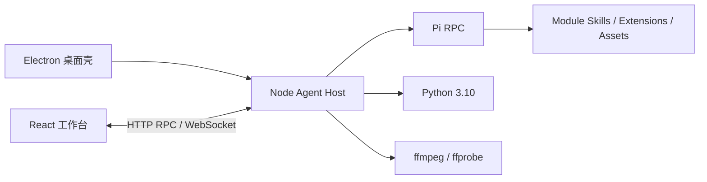

# TransportX Traffic Agent

TransportX Traffic Agent 是面向交通分析人员的本地桌面工作台。它把对话式分析、任务拆解、GIS 地图、视频处理、知识引用和报告输出放在同一个任务目录中，并保留数据来源、工具过程与产出文件。

当前版本为 `3.1.5`。正式桌面发行目标是 macOS 12+ Apple Silicon 和 Windows 10 22H2 / Windows 11 x64；Linux 目前只作为开发环境，不提供安装包。

## 主要能力

- 管理多个交通分析任务，支持流式回复、思考过程、工具调用、任务步骤和历史恢复。
- 上传并预览代码、表格、Markdown、图片和视频；任务产出可集中查看，Markdown 报告可导出 PDF。
- 发布受任务目录约束的 GeoJSON，以增量命令构建 MapLibre 地图。
- 在地图中选择要素、点位、矩形或当前视野，并把可审计的 Geo Context 附到下一条消息；Agent 也可以等待用户补充地图输入。
- 将当前地图、图例和说明导出为 PNG，直接保存到任务目录。
- 检索和处理会话内视频，支持播放、截图、裁剪、抽帧和时序指标。
- 在回答和报告中生成可核查引用，并回到原始知识资产的具体位置。
- 通过 Module 安装 Skill、Extension、Data、Knowledge 和 Template，按任务冻结实际使用的模块版本。

## 界面

首页提供交通问数、地图分析和报告生成入口：


同一工作台可以保留对话、工具过程和地图结果：


## 运行结构

项目是单仓库、模块化单体，没有第二套 Web UI 或远程业务后端。



- Electron 管理窗口、应用生命周期、Agent Host 子进程和桌面 PDF 下载。
- Node Agent Host 管理会话、模型、模块、文件、鉴权与本地资源边界。
- Pi RPC 负责推理和工具调用；每个任务使用独立工作目录。
- Python 执行受控的数据与空间分析，ffmpeg/ffprobe 处理视频。
- React 是唯一界面，通过 Browser Kernel 消费服务端 Snapshot 和实时事件。

完整边界与依赖方向见 [架构说明](./docs/ARCHITECTURE.md)。

## 开发启动

先安装依赖：

```bash
npm install
```

### 本地 Web 工作台

```bash
./start.sh
```

服务默认监听 <http://127.0.0.1:3000>。需要 React 热更新时，保留上述进程，再开一个终端运行：

```bash
npm run dev:web
```

Vite 地址为 <http://127.0.0.1:5173>，API 与 WebSocket 默认代理到 `127.0.0.1:3000`。

### Electron 开发模式

```bash
npm run desktop:dev
```

### 命令行模式

构建后可以直接在终端启动 TransportX Agent：

```bash
node bin/transportx.js
node bin/transportx.js --print "分析当前交通数据"
node bin/transportx.js modules list
```

通过 `npm link` 或安装 npm 包后，入口命令为 `transportx`。命令行默认不加载任何可选 Module；Task、Citation、Web Bridge、Geo、Spatial Analysis 和 Video 都需要通过可重复的 `--module <id[@version]>` 显式启用。`--no-modules` 可用于明确声明不加载可选 Module：

```bash
transportx --module com.transportx.task@1.0.1
transportx --module com.transportx.shanghaidata@2.0.1 --print "统计早高峰流量"
transportx --no-modules --model provider/model
```

CLI 仍通过 Agent Host 创建独立任务目录，并冻结精确的 Module 版本。Geo 框选、地图截图和视频播放等界面交互需要桌面工作台。

首次创建任务前，在“新建交通任务”或“设置”中添加一个 Pi 兼容模型。模型定义与密钥分开保存，API Key 不返回前端。

## 用户数据

| 平台 | 默认目录 |
|---|---|
| macOS | `~/.transportx/traffic-agent/` |
| Windows | `%APPDATA%\TransportX\traffic-agent\` |
| Linux 开发环境 | `$XDG_CONFIG_HOME/transportx-traffic-agent/` 或 `~/.config/transportx-traffic-agent/` |

目录中包含：

```text
<user-data>/
├─ scenario/                 每个任务的工作目录
├─ sessions/                 Pi 会话记录
├─ modules/<id>/<version>/   已安装 Module
├─ settings/                 平台设置
├─ logs/                     运行日志
├─ cache/                    可清理缓存
├─ models.json               模型定义
└─ auth.json                 模型密钥
```

可通过 `TAU_USER_DATA_DIR` 覆盖数据根目录，但该变量主要用于开发和受控部署。应用升级或卸载不会主动删除用户数据。

## Module

Module 是唯一安装和版本冻结单元，可以同时提供 Skill、Extension、Data、Knowledge 与 Template。用户可以从设置页选择包含 `manifest.json` 的目录或 ZIP；安装内容会复制到用户数据目录，显式启用后才参与新任务装配。

平台内置 Module 只提供 Workbench、Task、Geo、Spatial Analysis、Citation、Video 和 Web Bridge 等通用能力。`modules/installable/` 保存独立交付的交通数据、知识、样式和演示模块源码，它们不会进入安装包，也不是平台启动依赖。详见 [可安装模块说明](./modules/installable/README.md)。

大体积数据库、原始文档和检索索引不进入 Git。每个任务的 `ResolvedSessionPlan` 会记录实际启用的 Module 版本和资产，恢复任务时按该计划校验。

## 桌面打包

发布包内置 Pi CLI、Python 3.10 和 ffmpeg/ffprobe，不依赖用户机器上的 Conda、系统 Python 或 `PATH`。构建前必须准备对应平台和架构的可重定位运行时：

```bash
TRANSPORTX_PYTHON_RUNTIME_DIR=/absolute/path/to/python-runtime \
TRANSPORTX_FFMPEG_RUNTIME_DIR=/absolute/path/to/ffmpeg-runtime \
npm run desktop:pack
```

`npm run desktop:pack` 会根据当前宿主平台选择发布 Profile。macOS 正式包要求 Developer ID 签名和 Apple 公证；Windows 正式包要求 Authenticode 证书和可信时间戳。不要在 macOS 上交叉生成 Windows 正式包。

### Windows 10/11 x64

Windows 使用每用户 NSIS 安装器，允许选择安装目录，支持同一 `appId` 原位升级，卸载时保留 `%APPDATA%\TransportX\traffic-agent\`。应用窗口使用与其他桌面平台一致的无边框壳，最小化、最大化和关闭按钮位于左侧。在原生 Windows x64 主机的 PowerShell 中：

```powershell
$env:TRANSPORTX_PYTHON_RUNTIME_DIR = 'C:\TransportX\runtime\python-3.10-win-x64'
$env:TRANSPORTX_FFMPEG_RUNTIME_DIR = 'C:\TransportX\runtime\ffmpeg-win-x64'
$env:WIN_CSC_LINK = 'C:\secure\transportx-codesign.pfx'
$env:WIN_CSC_KEY_PASSWORD = '<certificate-password>'
npm ci
npm run desktop:pack
```

产物位于 `release/TransportX Traffic Agent-<version>-win-x64-setup.exe`。运行时目录分别需要包含 `python.exe`，以及 `ffmpeg.exe`、`ffprobe.exe` 和许可证文件。

内部结构验收可使用 `TRANSPORTX_ALLOW_UNSIGNED_BUILD=1`。如果离线 CI 的 Python 缺少项目依赖，还可额外设置 `TRANSPORTX_ALLOW_INCOMPLETE_PYTHON_RUNTIME=1`；该变量只能验证包结构，不能用于正式发行或功能验收。完整流程见 [Windows 发行指南](./docs/WINDOWS_RELEASE.md)。

### macOS arm64

本机结构验收可生成 ad-hoc 签名包：

```bash
TRANSPORTX_PYTHON_RUNTIME_DIR="$HOME/Library/Application Support/TransportX/python-3.10-runtime" \
TRANSPORTX_FFMPEG_RUNTIME_DIR="$HOME/Library/Application Support/TransportX/ffmpeg-runtime" \
TRANSPORTX_ALLOW_UNSIGNED_BUILD=1 \
npm run desktop:pack
```

正式 DMG 不设置 `TRANSPORTX_ALLOW_UNSIGNED_BUILD`，并需提供签名与公证凭据。

## 使用限制

- 不要用 `sudo` 启动服务或桌面应用，否则用户数据和模块目录的权限会被破坏。
- 在线底图需要网络；使用 `none` 底图时可以离线显示任务内 GeoJSON。
- 交通数据库、知识库原文、模型密钥和用户安装的 Module 不随源码或安装包分发。
- 发布版只使用包内运行时；环境变量覆盖仅用于开发、测试和受控部署。

## 验证

| 命令 | 验证范围 |
|---|---|
| `npm run typecheck` | 全部 TypeScript 项目 |
| `npm test` | Agent Host 启动、任务环境、Module 安装与进程退出 |
| `npm run test:web` | 真实 Node 服务、fake Pi 与 Chrome 中的 React 用户场景 |
| `npm run test:platform:macos` | macOS Electron 生命周期、内置运行时、PDF 与退出清理 |
| `npm run test:platform:windows` | Windows 未安装应用，或 NSIS 安装、启动、卸载和数据保留 |
| `npm run test:pi-smoke` | 本机真实 Pi RPC 冒烟；不纳入默认测试 |

Windows 测试需要设置 `TRANSPORTX_PACKAGED_APP` 或 `TRANSPORTX_WINDOWS_INSTALLER`，并在 Windows x64 主机运行。

## 仓库目录

```text
desktop/             Electron、平台 Profile、打包配置与发布脚本
modules/             内置能力、官方模块和可安装模块源码
prompts/             Pi 系统与会话 Prompt
src/contracts/       跨层协议与验证原语
src/server/          Node Agent Host
src/public/          Browser Kernel 与共享运行时
src/web/             React 工作台
scripts/             构建、冒烟、评测与测试 harness
test/                细粒度契约和边界测试
docs/                当前说明、发布指南、变更记录与归档
```

`bin/`、`public/*.js`、`public/geo-runtime.*`、`dist/web/`、`dist-desktop/`、`desktop/build/` 和 `release/` 是构建产物，不手工编辑或提交。

## 文档

- [架构说明](./docs/ARCHITECTURE.md)：当前系统边界、数据流、Module 模型与跨平台约束。
- [Windows 发行指南](./docs/WINDOWS_RELEASE.md)：运行时准备、签名、打包和安装器验收。
- [变更记录](./docs/CHANGELOG.md)：按版本记录用户、部署者与模块作者可见的变化。
- [历史实施文档](./docs/archive/README.md)：已完成设计、评审和旧版本资料的索引。

## License

MIT
