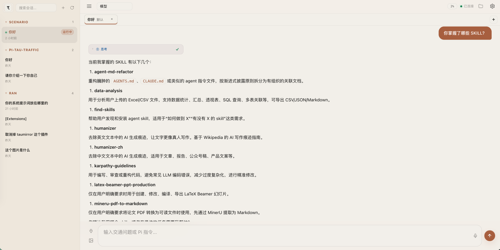
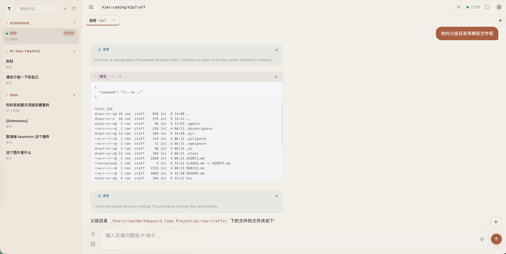

# Pi Traffic Workspace

一个面向交通分析场景的 Pi Web 工作台。项目基于 [milanglacier/pi-tau-web-server](https://github.com/milanglacier/pi-tau-web-server) 改造，保留其独立 Web Server 和多 Pi RPC 会话架构，并在此基础上做了中文化、界面整理和交通工作台方向的产品化探索。

> 当前阶段更接近“交通 Agent 工作台底座”：已经具备多会话、工具调用、思考过程、文件浏览、技能/工具查看等通用能力；真实交通数据、交通专用工具和业务结果卡片仍在规划中。

## 核心形态

```text
Browser UI
  <-> HTTP / WebSocket
Pi Traffic Workspace Server
  <-> JSONL RPC
pi --mode rpc child session 1
pi --mode rpc child session 2
pi --mode rpc child session N
```

相比把一个终端 Pi 会话镜像到浏览器，这个项目更像一个浏览器里的多任务工作台：浏览器负责展示与交互，Node.js Server 负责管理多个 `pi --mode rpc` 子进程，后端 Pi 会话不会因为页面刷新而立刻丢失。

## 主要能力

- 多个 Pi RPC 会话并行运行、切换、恢复和关闭。
- 左侧会话栏同时展示历史会话和运行中会话。
- 顶部任务标签页、模型选择、思考级别、上下文统计。
- Codex 风格的白色 / 淡蓝简洁 UI。
- 思考卡片与工具调用卡片的统一视觉展示。
- 工具调用耗时、思考耗时展示，并尽量在历史会话中恢复。
- 代码块和渲染卡片支持折叠 / 展开。
- 右侧工作区面板支持切换查看：
  - 文件
  - 技能
  - 工具
  - 地图
- 内置 Pi GIS Extension，Agent 可发布会话内 GeoJSON，并在 Web 端展示声明式交互地图。
- 地图支持点、线、面、文字图层，常量/分类/分段/连续编码，安全 Popup、图层显隐和选中高亮。
- 默认新建任务目录指向 `scenario/`，适合作为后续交通 demo 的工作目录。

## 产品示意图





## 快速开始

```bash
npm install
npm run build
pi-traffic-workspace
```

默认访问地址：

```text
http://localhost:3001
```

也可以指定端口和主机：

```bash
pi-traffic-workspace --host 127.0.0.1 --port 3001 --open
```

项目兼容上游的 `TAU_*` 环境变量：

```bash
TAU_PORT=3001 TAU_HOST=0.0.0.0 pi-traffic-workspace
```

## 开发命令

```bash
npm run build
npm test
npm run typecheck
```

在本项目的 Codex 工作流里，通常使用：

```bash
rtk npm run build
```

如果本地调试需要直接启动编译后的入口：

```bash
rtk node bin/tau.js --host 127.0.0.1 --port 3000
```

## 项目结构

```text
src/server/
  server-main.ts       # HTTP API、WebSocket、RPC 分发、文件与资源接口
  sessions.ts          # Pi RPC 子进程和 live session 生命周期管理
  config.ts            # 端口、host、session 目录、静态资源目录
  model-utils.ts       # 模型列表与 provider/model 解析
  geo-resources.ts     # 会话隔离的 GeoJSON 资源读取、缓存和边界校验

src/public/
  app-main.ts          # 浏览器主状态、会话切换、WebSocket 事件、右侧面板协调
  message-renderer.ts  # 消息、Markdown、思考卡片、复制逻辑
  tool-card.ts         # 工具调用卡片、中文工具名、耗时、折叠/展开
  session-sidebar.ts   # 左侧会话列表与 live session 同步
  file-browser.ts      # 右侧文件树和拖拽插入路径
  model-picker.ts      # 模型和 thinking level 选择
  visualization/      # 可视化协议、会话状态与 MapLibre Runtime

extensions/
  pi-geo-visualization/ # 随 Pi 会话自动加载的 GIS Extension

public/
  index.html           # 页面骨架
  style.css            # 全局样式
  geo-runtime.*        # 构建生成的 MapLibre 懒加载 bundle

PROJECT_HANDOFF.md     # 给下一位 Agent 和人类开发者的交接说明
```

## 构建产物说明

TypeScript 源码会编译到：

```text
bin/*.js
public/*.js
public/visualization/*.js
public/geo-runtime.*
```

这些文件被 `.gitignore` 忽略。修改 `src/` 后需要运行 `npm run build`，本地启动时才会看到最新逻辑。

## 当前实现状态

已完成：

- 从 `pi-tau-web-server` 改造成交通工作台方向的独立项目。
- 包名和 CLI 名称调整为 `pi-traffic-workspace`。
- 浏览器 UI 主要文案中文化。
- 会话创建改为“输入会话名称”，任务目录默认使用 `scenario/`。
- 左侧侧栏与运行中会话同步。
- 思考卡片、工具卡片、消息渲染、代码块折叠和整体 UI 美化。
- 右侧面板增加 `文件 / 技能 / 工具` 切换。
- 增加 `地图` 工作区、内置 Pi GIS Extension、GeoJSON 资源发布和 MapLibre Web 渲染闭环。
- 可视化快照随工具结果进入会话历史，支持 live snapshot、历史查看和 resume 恢复。
- 新增项目交接文档 `PROJECT_HANDOFF.md`。

尚未完成：

- 真实交通数据接入。
- 交通专用 Prompt / Skill。
- `traffic.*` 业务工具。
- 交通结果卡片。
- GIS filter/图例、通用格式转换、矢量瓦片、栅格、时序和地图到 Agent 的反向联动。
- Pi 完整工具清单的原生 RPC 暴露。

## 技能与工具查看

右侧工作区面板里的 `技能` 来自 Pi 当前会话的 `get_commands` 结果，并筛选 `source === "skill"`。

`工具` 当前展示：

- 内置工具：`读取`、`命令`、`编辑`、`创建`
- 当前会话中已经出现过的工具调用统计

注意：Pi 扩展 API 中存在 `pi.getActiveTools()` 和 `pi.getAllTools()`，但当前 Pi RPC 没有原生 `get_tools`。如果后续要展示完整注册工具列表，需要增加 Pi 扩展桥接或扩展 RPC。

## GIS 地图工作流

每个 Pi 会话都会自动加载包内的 GIS Extension，并获得两个声明式工具：

- `publish_geodata`：校验并发布任务目录内的 `.geojson`/`.json` 文件，返回稳定的会话资源 ID。
- `present_visualization`：创建、更新、聚焦、选择或清除地图 Scene；工具结果不包含可执行 JavaScript、HTML 或 MapLibre 原生表达式。

少量数据可以直接使用 `geojson-inline`；较大数据应先发布，再以 `geojson-resource` 引用。Web 端从工具卡进入右侧“地图”工作区，资源只允许从对应 live session 的任务目录读取。完整协议、边界和后续阶段见 [GIS Web 展示模块技术方案](./docs/GIS_WEB_VISUALIZATION_TECHNICAL_PLAN.md)。

`default`/`light`/`dark` 使用 Runtime 白名单内的 OpenFreeMap 矢量底图，需要网络；`none` 保留项目自带的纯色离线底图。Web 制图层会自动为业务线路增加 casing、为点位增加交互 halo，并让底图地名保留在交通线网上方。

## 后续路线

建议按这个顺序继续推进：

1. 增加交通任务模板，例如早高峰拥堵排行、异常路段诊断、区域运行态势、交通运行日报。
2. 增加交通 Prompt / Skill，先规范分析口径和输出结构。
3. 增加 mock traffic tools，先跑通工具调用和业务结果链路。
4. 增加交通结果卡片，让结构化结果不只依赖 Markdown。
5. 再接真实交通数据库或外部 API。

更详细的交接、坑点和下一步建议请看 [PROJECT_HANDOFF.md](./PROJECT_HANDOFF.md)。

## 与上游的关系

本项目基于 [milanglacier/pi-tau-web-server](https://github.com/milanglacier/pi-tau-web-server) 改造。建议把本仓库作为独立产品仓库维护，同时保留上游 remote：

```bash
git remote add upstream https://github.com/milanglacier/pi-tau-web-server.git
```

以后如需同步上游能力，可以选择性 merge 或 cherry-pick，而不是直接覆盖当前交通工作台方向的改动。

## License

MIT
