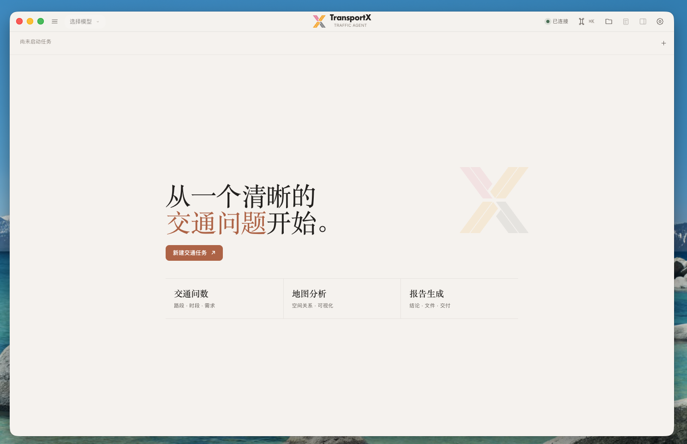
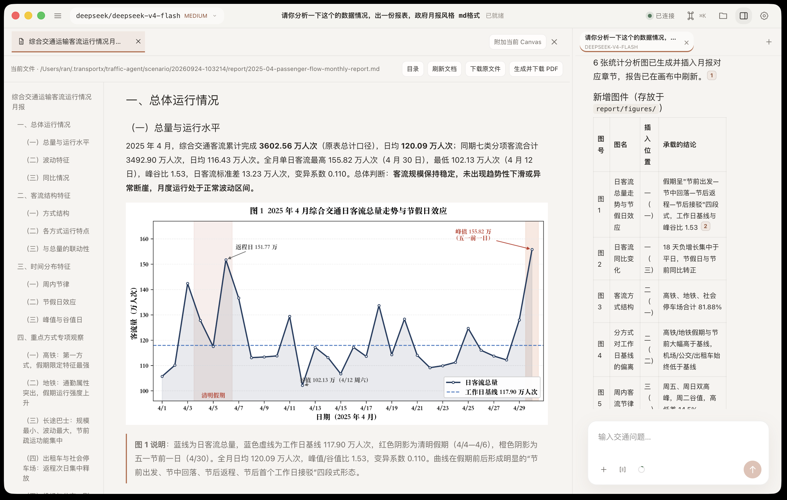
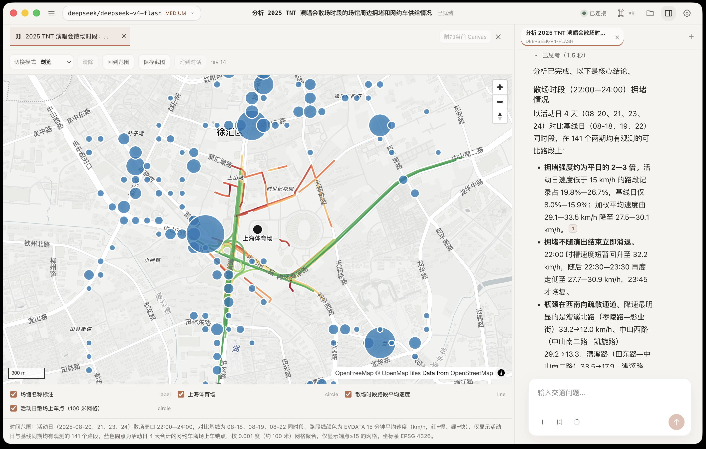
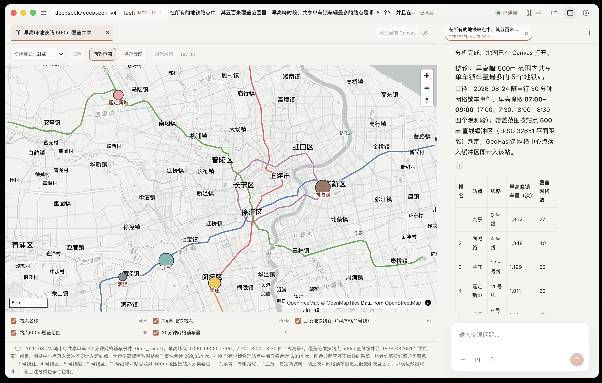
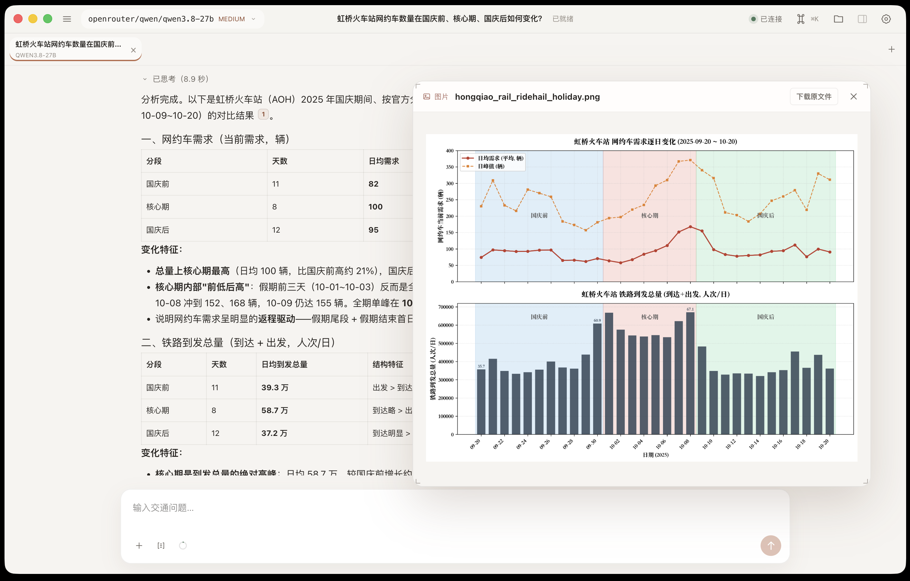
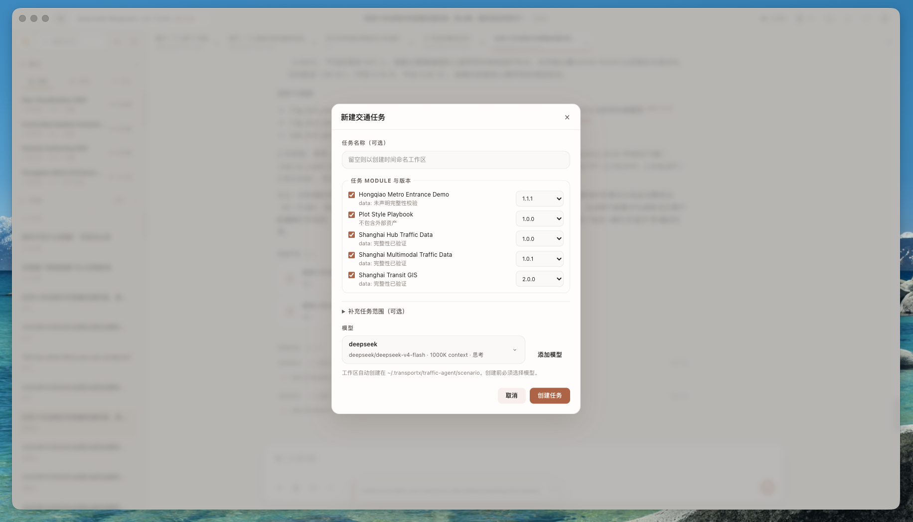
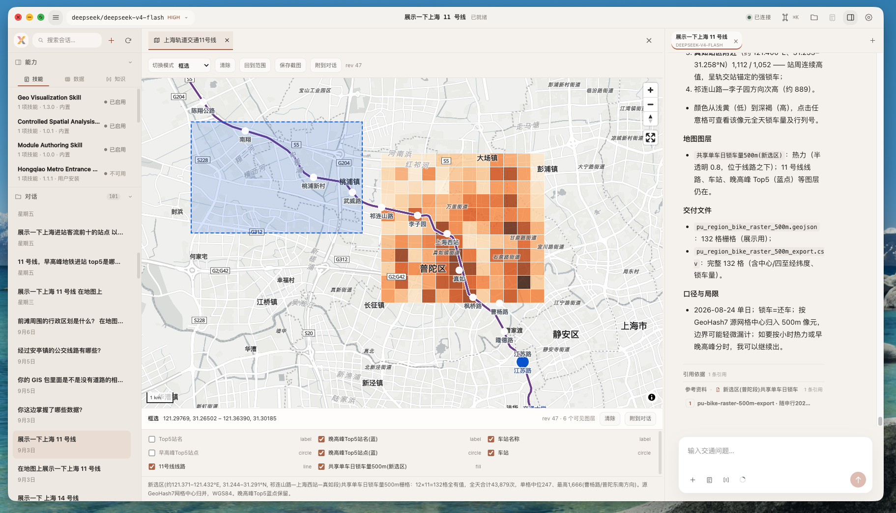

<div align="center">
  
  <h1>TransportX Agent</h1>
  <p><strong>TransportX Agent — an AI agent working alongside you to solve real-world transportation problems.</strong></p>
  <p>Ask about roads, transit, traffic demand, and mobility data. TransportX turns the work into maps, charts, cited findings, and reports while keeping the source files and tool history close at hand.</p>
  <p>
    
    
    
  </p>
  <p><strong>English</strong> · <a href="./README.zh-CN.md">简体中文</a></p>
</div>

## Why TransportX

Coding agents such as Codex and Claude Code have improved quickly, but using them still often means working with code, terminals, and unfamiliar file structures. That remains a real barrier for many domain specialists, particularly non-programmers who need to analyze traffic data or build map-based explanations.

TransportX began with a simple goal: make agent-assisted analysis practical for transport professionals. It is a lightweight desktop workspace for asking questions, inspecting maps and charts, and delivering results with their evidence attached. The core stays small. Modules add the data, knowledge, methods, and tools required by a field, which also makes the platform useful beyond transport.

<p align="center">
  
</p>

The home screen starts a traffic task and links the core workflow: ask a question, analyze it on a map, and deliver a report.

## Built for traffic analysis

TransportX gives analysts one place to ask questions, inspect evidence, work with maps, and deliver results. Each task has its own workspace, conversation history, files, and resolved capability versions.

### A composable module system

TransportX extends through Modules instead of hard-coding domain logic into the app. Modules can wrap Agent Skills from different tools when they use a `SKILL.md` entry point, then package them with Extensions, datasets, knowledge collections, report templates, and native runtimes. Each task loads only the Modules it needs and records their exact versions, so teams can add another domain without forking the platform and later reopen the task with the same capability set.

### Shared GIS context

The agent and analyst work with the same map state. The agent can publish GeoJSON and update layers; the analyst can select features, mark a point, draw a rectangle, or submit the current viewport. TransportX attaches that input to the next message as structured Geo Context, so follow-up analysis keeps the same map revision and spatial scope without asking the analyst to describe the location again.

| | What TransportX provides |
|---|---|
| **Conversational analysis** | Ask questions in natural language and follow the model's responses, tool calls, and generated files. |
| **Interactive GIS** | Share a versioned map context: the agent publishes and updates layers, while the analyst returns features, points, rectangles, or the current viewport. |
| **Data, charts, and video** | Analyze tables, databases, and code; create charts; install Video Capability for search, playback, snapshots, clips, frame sampling, and time-series metrics. |
| **Traceable findings** | Keep citations, map context, source files, and tool output connected to the conclusion that used them. |
| **Report delivery** | Build Markdown reports with figures and citations, then export them as PDF from the desktop app. |
| **Versioned capabilities** | Reuse `SKILL.md`-based Agent Skills or add custom Extensions, Data, Knowledge, Templates, and native runtimes through Modules. |

## Product screenshots

The screenshots show how TransportX combines maps, analysis, figures, and reports in one workspace. They capture example tasks; the underlying traffic datasets are not included in this repository.

| Monthly passenger-flow report | Event traffic around Shanghai Stadium |
|---|---|
|  |  |
| Review a generated report with charts and citations, then export it as PDF. | Compare road speeds and parking demand around an event venue on the map. |

| Metro and shared-bike connections | Holiday ride-hailing demand |
|---|---|
|  |  |
| Inspect station rankings and nearby transit lines on the same map. | Compare ride-hailing demand before, during, and after a holiday alongside rail arrivals. |

| Set up an analysis task | Select an area on the map |
|---|---|
|  |  |
| Choose a model and Module versions when creating a task. | Send a selected map area back to the agent as geographic context. |

## How it works

The desktop, Web, and CLI clients share one local Agent Host. It manages sessions, resources, models, and versioned Modules; Pi runs the agent loop and calls the selected model, Python analysis environment, and domain services.

## Design principles

- **The map is both output and input.** The agent can create spatial layers, and analysts can return a point, feature, rectangle, or viewport as structured context.
- **Work stays inspectable.** Sessions retain tool activity, source references, attachments, maps, and derived artifacts instead of flattening everything into chat text.
- **Capabilities are explicit.** Data, domain knowledge, analysis methods, and native tools are installed as Modules, selected when a task starts, and pinned for recovery.

## Quick start

Run the desktop app from source:

```bash
npm install
npm run desktop:dev
```

Before creating the first task, add a Pi-compatible model from **New Traffic Task** or **Settings**.

> Traffic databases, source knowledge collections, model credentials, and user-installed Modules are not distributed with the repository.

## Platform support

| Platform | Status |
|---|---|
| macOS 12+ on Apple Silicon | Desktop release target |
| Windows 10 22H2 / Windows 11 x64 | Desktop release target |
| Linux | Source development only |

The desktop app is built with Electron and React. A local Node.js Agent Host owns sessions and resource boundaries, while [Pi](https://github.com/earendil-works/pi) runs the model and tool loop. Python 3.10 ships with the desktop application; the video runtime is installed separately with Video Capability.

## Documentation

| Guide | Covers |
|---|---|
| [Architecture](./docs/ARCHITECTURE.md) | Process boundaries, data flow, resource model, and security constraints |
| [Changelog](./docs/CHANGELOG.md) | Releases and compatibility changes |

## Acknowledgements

TransportX builds on and has benefited from these open-source projects:

- [Pi](https://github.com/earendil-works/pi) provides the agent runtime, model integration, and tool loop.
- [Pi Tau Web Server](https://github.com/milanglacier/pi-tau-web-server) is the upstream foundation for the browser workspace and Pi RPC session architecture.
- [MapLibre GL JS](https://github.com/maplibre/maplibre-gl-js) powers interactive map rendering.
- [Electron](https://github.com/electron/electron) and [React](https://github.com/facebook/react) provide the desktop and interface foundations.

Thank you to their maintainers and contributors.

Thanks also to these product testers:

<table>
  <tr>
    <td align="center" width="25%">
      <a href="https://github.com/aowang-ai"><br /><strong>@aowang-ai</strong></a>
    </td>
    <td align="center" width="25%">
      <a href="https://github.com/yonghenggudu"><br /><strong>@yonghenggudu</strong></a>
    </td>
    <td align="center" width="25%">
      <a href="https://github.com/runningjian-ui"><br /><strong>@runningjian-ui</strong></a>
    </td>
    <td align="center" width="25%">
      <a href="https://github.com/tataxing123"><br /><strong>@tataxing123</strong></a>
    </td>
  </tr>
</table>

## License

TransportX Agent is licensed under [AGPL-3.0-only](./LICENSE). Commercial use is permitted under its terms. For alternative commercial terms covering project-owned code, contact the maintainers.

Upstream MIT-licensed material retains its original terms and notices; see [Third-party source notices](./THIRD_PARTY_NOTICES.md).
