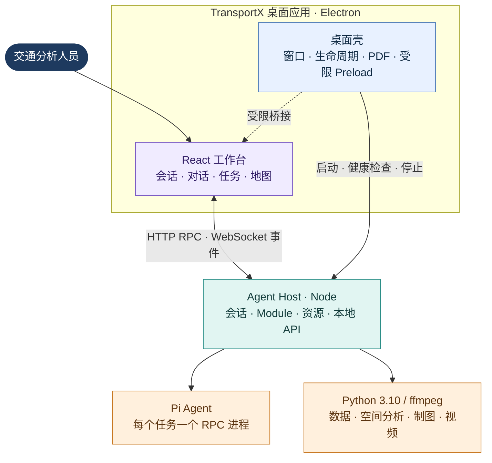

# TransportX Traffic Agent 架构

- 产品版本：3.1.5
- 文档状态：当前实现的架构权威
- 更新日期：2026-09-04
- 发布 Profile：macOS arm64（DMG）与 Windows x64（NSIS）；Linux 不是发布目标

TransportX Traffic Agent 是本地优先的交通分析桌面工作台。它是一个单仓库、单 npm 包、模块化单体：Electron 管理桌面生命周期，Node Agent Host 是唯一业务后端，Pi RPC 负责推理与工具调用，Python 运行受控的数据和空间分析，React 提供唯一的用户界面。

不维护第二套 Web UI、远程业务服务或第二种 Agent Runtime。开发时可将 Agent Host 作为本地 Web 服务启动；业务边界与桌面版相同。

## 1. 项目目录速览

```text
pi-tau-traffic/
├─ desktop/                    Electron 主进程、Supervisor、平台 Profile 与打包脚本
│  ├─ assets/                  图标、签名与平台资源
│  └─ scripts/                 runtime 准备、发布前检查、打包钩子
├─ modules/                    随应用发布或由用户安装的能力单元
│  ├─ capabilities/            Task、Geo、Citation、Video 等平台通用能力
│  ├─ official/                Workbench、报告模板、Module Authoring
│  └─ installable/             独立交付的交通数据、知识与风格模块源码
├─ prompts/                    Pi 系统与会话 Prompt
├─ src/
│  ├─ contracts/               跨层协议与验证原语；不依赖具体运行时
│  ├─ server/                  Node Agent Host、会话、资源、HTTP/RPC 与鉴权
│  ├─ public/                  浏览器 Kernel、共享工具与 Geo runtime 源码
│  └─ web/                     React 工作台、功能面板、组件、i18n 与样式
├─ scripts/                    场景测试、fake Pi harness、eval 与构建辅助
├─ test/                       细粒度诊断测试与固定 fixtures
├─ docs/                       架构、发布说明、变更记录与历史文档
├─ package.json                构建、开发、发布与场景测试入口
└─ tsconfig*.json / vite.config.ts
                              TypeScript 与前端构建配置
```

以下目录由构建生成，不手工编辑或提交：`bin/`、`public/*.js`、`dist/web/`、`dist-desktop/`、`desktop/build/`、`release/`。

## 2. 运行时边界



### Electron Main

`desktop/main.ts` 与 `desktop/agent-host-supervisor.ts` 只承担桌面壳职责：

- 单实例、窗口创建、外链交给系统浏览器、退出时清理 Agent Host 进程树；
- 在加载工作台前等待 Agent Host 的版本化 ready 消息，并校验 `/api/health`；
- 已打包应用启动前验证 `runtime-manifest.json` 中 Agent Host、Pi 与 Python 的路径和 SHA-256；
- 以禁用 JavaScript 且阻断网络的隐藏窗口生成 PDF；
- macOS 保留原生 traffic lights；Windows/Linux 使用无边框窗口和 React 渲染的最小化、最大化、关闭按钮，控件位于左侧并沿用 macOS 顺序。

Renderer 始终使用 `nodeIntegration: false`、`contextIsolation: true`、`sandbox: true` 和 `webviewTag: false`。Preload 不提供通用 Node/Electron 能力，只暴露：受同源校验的 PDF 下载、上传文件真实路径，以及非 macOS 的窗口控制。

### Agent Host

`src/server/server-main.ts` 是唯一业务组合入口。它监听随机 `127.0.0.1` 端口，提供：

- HTTP API 与带 `clientCommandId` 的可靠 RPC；
- WebSocket 实时事件与 Snapshot 更新；WebSocket 不接受有副作用命令；
- Session、附件、文件预览、本机打开、引用、报告、Geo、空间分析和视频资源；
- 模型配置、认证、Module Registry/Installer、Asset Resolver 与 Session Assembly；
- Pi、Python、ffmpeg 的受控调用。

Electron 不复制上述业务逻辑；命令行/Web 开发模式也复用同一个 Agent Host。

### Pi、Python 与 ffmpeg

每个任务以 Pi RPC 进程运行。Session Assembly 将本任务精确解析出的模型、Extension、Skill、Prompt、Module Asset 根目录和工作目录传入 Pi。Pi 的历史 Session JSONL 是已完成对话的事实来源。

发布版使用随包 Pi、Python 3.10 和 ffmpeg/ffprobe；开发模式仅能通过明确环境变量覆盖。Python 作业由 Agent Host 控制工作目录、UTF-8、超时、取消与进程回收，不得依赖开发机 Conda 或系统 Python。内置 Python 要求包含 `ssl`、`sqlite3`、PyYAML、NumPy、Matplotlib、Pandas、PyProj、Shapely。

### React Workspace 与 Browser Kernel

Canvas 在工作区顶部以具名标签承载当前任务的地图和视频。Canvas 统一管理打开的引用与活动标签，领域面板接收指定成果并维护缩放、图层和播放状态。Agent 的展示工具激活对应标签；`show_map` 只显示已有地图，不推进 revision。关闭标签不删除成果；切换标签不重复挂载视图，隐藏视频暂停。

`src/public/` 提供浏览器端的 Kernel、Markdown/工具结果处理和 Geo runtime；`src/web/` 负责 React 应用、功能面板、i18n 与样式。React 通过 Kernel 消费 Snapshot/事件并发送命令，不解析原始 Pi RPC，也不直接访问本机文件。

## 3. 关键数据流

### 创建并运行交通任务

```text
新建任务（模型 + 任务范围 + 已启用 Module）
  → Module Registry / Asset Resolver
  → Session Assembly
  → ResolvedSessionPlan v3（精确版本与完整性冻结）
  → Pi RPC Session（cwd、Skills、Extensions、Assets）
  → Agent Host Snapshot + WebSocket 事件
  → Browser Kernel
  → React Conversation / Task / Geo / Citation 界面
```

新任务必须显式选择模型。`ResolvedSessionPlan v3` 记录实际 Module、入口、Asset 与运行时信息；恢复任务时以该计划校验，而不是悄然替换为当前最新 Module。内置 Module 有受控漂移容忍规则；用户安装 Module 的缺失或不一致必须明确处理。

Prompt、steer、abort 与 Extension UI response 先经 HTTP RPC 确认，再更新前端状态。WebSocket 只用于实时 Pi 事件和 Snapshot；断线或刷新后由 Agent Host Snapshot 重新校正。

### 文件、引用、地图与视频

- 附件先上传到任务工作区，再以 `attachmentIds` 关联后续消息；服务端再次校验归属、状态、真实路径和文件存在性后才向 Pi 提供上下文。
- Citation、File、Preview、Geo、Video 和 Spatial Analysis 都以活动 Session cwd 为边界。跨会话路径、路径逃逸和符号链接越界必须拒绝。
- 用户可从地图提交要素、点位、矩形或当前视野四类 Geo Context，并显式附到下一轮消息。Agent 通过 `inspect_map_context` 读取本轮上下文，也可用 `request_geo_input` 等待用户在指定地图 revision 上补充输入；提交、取消、超时、中止和地图失效都有明确终态。
- 地图截图由工作台按当前画面、图例和说明生成 PNG，再写入当前任务目录。截图不扩大资源访问范围。
- Spatial Analysis 只处理当前会话的 GeoJSON，使用受控 Python 生成 WGS84 GeoJSON 与包含输入、参数、计数和哈希的 manifest，再发布到 Geo 界面。
- Video 资源与指标由 Agent Host 的受控 ffmpeg/ffprobe 入口处理；发布版不得依赖系统 `PATH`。

## 4. 契约与事实来源

| 内容 | 权威来源 | 主要消费者 |
|---|---|---|
| Session、Task、Geo、Citation、附件等跨层协议 | `src/contracts/` | Extension、Server、Kernel、React |
| 已完成的对话历史 | Pi Session JSONL | Session Projection、历史 API |
| 实时会话状态 | Agent Host live overlay | WebSocket、Browser Kernel |
| 任务装配结果 | `<task>/.tau/resolved-session-plan*.json` | Session 恢复、审计 |
| 附件索引 | `<task>/.tau/attachments.json` | Attachment API、会话投影 |
| Citation/Geo/Video 资源 | 任务 cwd 下的受控资源目录 | 对应资源 API 与 React 面板 |
| 地图交互上下文与等待请求 | Session Snapshot、Geo Interaction Service | Pi Geo 工具、Browser Kernel、React Geo Workspace |
| 模型定义与密钥 | 用户目录 `models.json`、`auth.json` | Agent Host、Pi；密钥不返回前端 |
| Module 声明与完整性 | Module `manifest.json`、`integrityFile` | Registry、Installer、Session Assembly |
| 打包运行时 | `runtime-manifest.json` | Electron Supervisor、Runtime Resolver |

`src/contracts/` 必须保持纯粹：不依赖 Node、Electron、React、DOM 或 MapLibre。任何跨层字段先定义契约和解析规则，再实现服务端、Kernel、UI 适配。

磁盘、JSON 和跨平台协议中的相对路径一律采用 POSIX `/`；路径边界在 Node 中通过 `path.relative` 和统一的 `isWithin` 判定，不使用字符串前缀比较。

## 5. Module 与资产模型

Module 是唯一安装与版本冻结单元，可组合贡献 Skill、Extension、Data、Knowledge 与 Template。Skill/Extension/Data/Knowledge 不单独安装，全部由 Manifest 的 `entrypoints` 与 `contributes` 描述。

| 来源 | 位置 | 用途 |
|---|---|---|
| 内置 capability | `modules/capabilities/` | Task、Citation、Geo、Spatial Analysis、Video、Web Bridge 等通用机制 |
| 内置 official | `modules/official/` | Workbench、报告模板、Module Authoring |
| 用户可安装源码 | `modules/installable/` | 上海数据、交通保障知识、绘图风格、演示数据；不打入应用 |
| 用户受管 Module | 用户目录 `modules/<id>/<version>/` | 安装后显式启用，参与新任务装配 |

平台能力不依赖用户 Module。Data/Knowledge 的大体积资产、原始资料、索引和精确定位映射不进入 Git 或桌面安装包；解析后通过 `TRANSPORTX_TRAFFIC_DATA_ROOT`、`TRANSPORTX_KNOWLEDGE_ROOT` 等会话环境变量提供给 Pi/脚本。

安装器拒绝符号链接、绝对入口、路径逃逸、重复 ID 和缺少入口；带 `integrityFile` 的资产在安装及解析阶段验证 SHA-256。Module 改动必须同步提升其 `manifest.json` 版本并记录 CHANGELOG。

## 6. 目录与持久化

### 仓库

```text
desktop/                 Electron、Supervisor、平台 profile、打包脚本
modules/                 内置能力、官方模块与可安装模块源码
prompts/                 Pi 系统与会话 Prompt
src/contracts/           跨层协议
src/server/              Agent Host、会话、资产、HTTP/WebSocket、鉴权
src/public/              Browser Kernel、共享运行时、Geo runtime
src/web/                 React 工作台
scripts/                 场景测试、harness、eval、构建辅助
test/                    细粒度诊断/契约测试与 fixtures
docs/                    当前文档与历史记录
```

`bin/`、`public/*.js`、`dist/web/`、`dist-desktop/`、`desktop/build/`、`release/` 是生成物，不手工编辑或提交。

### 用户数据

| 平台 | 默认根目录 |
|---|---|
| macOS | `~/.transportx/traffic-agent/` |
| Windows | `%APPDATA%\TransportX\traffic-agent\` |
| 非发布 Linux 开发模式 | `$XDG_CONFIG_HOME/transportx-traffic-agent` 或 `~/.config/transportx-traffic-agent` |

```text
<user-data>/
├─ scenario/<task>/             每个任务的受控工作区
├─ sessions/                    Pi Session JSONL
├─ modules/<id>/<version>/      受管 Module
├─ settings/                    平台设置
├─ logs/                        Agent Host 等日志
├─ cache/                       Python/Matplotlib 等可清理缓存
├─ models.json                  模型定义
└─ auth.json                    模型密钥
```

`TAU_USER_DATA_DIR` 只用于开发或受控部署覆盖。安装包资源始终只读；升级和卸载不应删除用户数据。任务工作区中的附件、计划和派生资源均属于该任务，不可被其他任务直接读取。

## 7. 安全边界

1. Agent Host 默认只监听随机回环端口；HTTP/WebSocket 做同源与本地认证校验。
2. 可靠命令使用 HTTP RPC，WebSocket 是事件通道，不接受副作用操作。
3. Renderer 隔离 Node 与 Electron；Preload 能力按参数和调用方严格限制。
4. Session cwd 是附件、文件、引用、地图和视频资源的授权边界；读取前验证真实路径、文件类型、哈希或资源清单。
5. API Key 不返回 Renderer；模型配置与密钥分离并采用原子写入，密钥文件仅允许当前用户读写。
6. 打包运行时在桌面启动前校验相对路径与 SHA-256；安装器和运行时准备拒绝不符合目标架构的 Python/ffmpeg。
7. PDF 使用禁用 JavaScript 的临时隐藏窗口，阻断 `about:`/`data:` 以外的请求。

Module 是本机可信代码与数据包，而非操作系统级沙箱插件。若未来开放第三方市场，必须单独设计签名、权限与隔离模型。

## 8. 打包与平台 Profile

`desktop/scripts/platform-profile.mjs` 是发布平台事实的唯一来源：Python 入口与架构、ffmpeg 名称/权限/架构检查、签名要求、安装器类型与冒烟能力均在此声明。

```text
desktop/electron-builder.yml
  ├─ electron-builder.common.yml   通用资源与 asar 规则
  ├─ electron-builder.mac.yml      macOS arm64 DMG
  └─ electron-builder.win.yml      Windows x64 NSIS
```

`npm run desktop:pack` 在目标平台运行同一入口：

1. `check-desktop-release.mjs` 根据 Profile 验证宿主架构与签名条件；
2. `prepare-runtime.mjs` 复制并实际启动 Python、ffmpeg、ffprobe，生成哈希清单；
3. electron-builder 按对应 fragment 打包；
4. macOS 正式发行需要 Developer ID + 公证，Windows 正式发行需要 Authenticode + 可信时间戳。

不要从 macOS 交叉生成 Windows 正式包。完整 Windows 验收与环境变量见 [WINDOWS_RELEASE.md](WINDOWS_RELEASE.md)。

`TRANSPORTX_ALLOW_UNSIGNED_BUILD=1` 只用于内部未签名结构验收。`TRANSPORTX_ALLOW_INCOMPLETE_PYTHON_RUNTIME=1` 还能跳过缺失 Python 模块的预检，但不会让不完整运行时具备真实功能；两者都不得用于正式发行。

## 9. 依赖方向与演进规则

```text
Electron Main ───────────────> Desktop Supervisor
Server / Extension / Kernel ─> contracts
server-main ─────────────────> routes + services + session/module/runtime 组件
Session Assembly ────────────> Registry + Asset Resolver + Runtime Resolver
React components ────────────> Browser Kernel + Command ports
Geo runtime ────────────────> contracts + MapLibre
```

- Contract 不导入平台代码；Kernel 不导入 React；Server handler 不依赖 UI。
- React 不直接读文件或解析原始 Pi RPC；Electron 不承载 Agent Host 业务规则。
- 新领域能力优先做 Module/Asset，而不是把城市、项目或知识库路径写进 Platform Core。
- `server-main.ts` 只做组合；新增 API 进入独立 route/handler 与对应契约。
- 新平台先增加 platform profile、electron-builder fragment 和目标平台场景测试，不在业务代码中散落新的 OS 分支。

## 10. 场景验证

测试入口按用户可见场景划分；细粒度 `test/` 用例仅用于定位协议或边界问题，不是日常发布门禁。

| 入口 | 场景 | 运行条件 |
|---|---|---|
| `npm test` | Agent Host 启动、创建任务环境、安装/卸载 Module、健康检查与退出 | 任意开发主机 |
| `npm run test:web` | 浏览器中创建交通任务、获得分析、发布地图 | 本机 Chrome + fake Pi |
| `npm run test:platform:macos` | Electron、Agent Host、PDF、内置 Python、退出清理 | macOS；可用 `TRANSPORTX_PACKAGED_APP` 验证 DMG/.app |
| `npm run test:platform:windows` | Windows 未安装应用启动，或 NSIS 安装/启动/卸载/数据保留 | Windows x64；设置 `TRANSPORTX_PACKAGED_APP` 或 `TRANSPORTX_WINDOWS_INSTALLER` |

此外，`npm run typecheck` 检查全部 TypeScript 项目，`npm run test:pi-smoke` 是显式运行的真实 Pi RPC 冒烟，`eval:traffic` 系列用于交通任务评估，不纳入日常场景验证。
