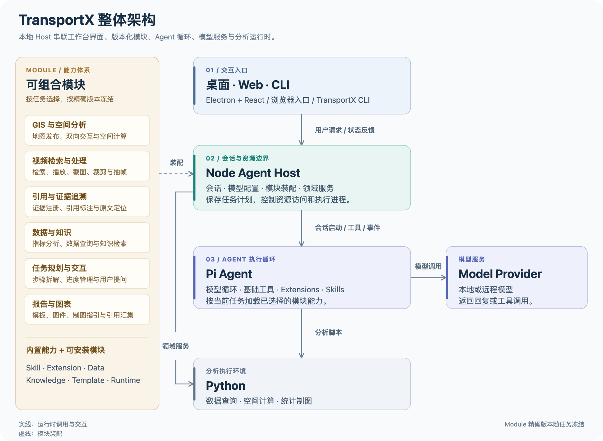
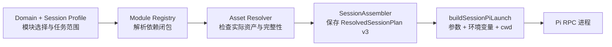
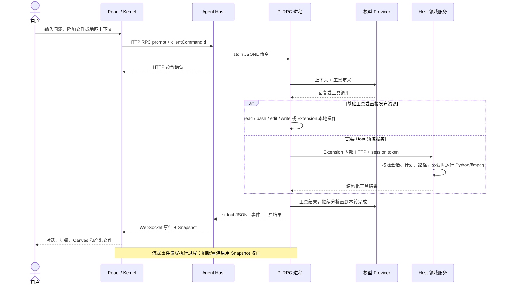
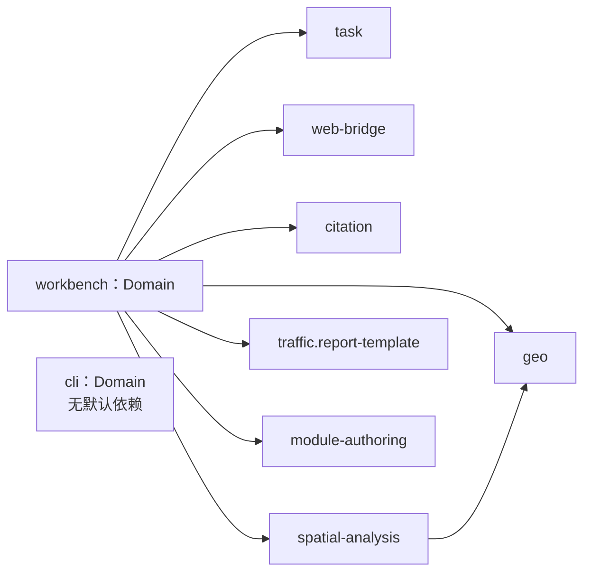
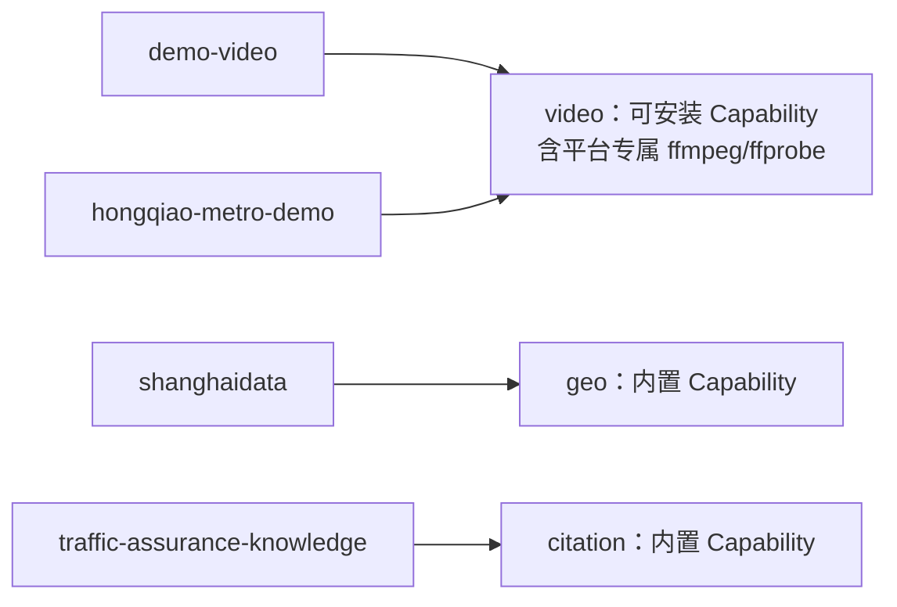

# TransportX Agent 架构

- 产品版本：3.2.0
- 文档状态：当前实现的架构权威
- 更新日期：2026-09-18
- 发布 Profile：macOS arm64（DMG）与 Windows x64（NSIS）；Linux 不是发布目标

TransportX Agent 是面向交通分析的桌面工作台。Agent 与分析人员共享同一份 GIS 上下文，领域能力按任务装配。项目采用单仓库、单 npm 包和模块化单体架构：Electron 管理桌面生命周期，Node Agent Host 是唯一业务后端，Pi 框架负责模型调用循环与工具执行，Python 执行分析脚本，React 提供图形工作台。CLI 是共用后端的终端客户端。

模型推理由配置的 Provider 提供，可使用远程 API 或本地服务；仓库没有自研模型推理引擎。本文以当前源码、Module manifest 和打包配置为依据，历史方案仅用于了解背景。

阅读顺序：第 2 节看进程与技术栈，第 3 节看执行闭环与功能位置，第 5 节看模块装配和依赖，第 4、6、7 节看状态与资源边界。

## 1. 项目目录速览

```text
pi-tau-traffic/
├─ desktop/                    Electron 主进程、Supervisor、平台 Profile 与打包脚本
│  ├─ assets/                  图标、签名与平台资源
│  └─ scripts/                 runtime 准备、发布前检查、打包钩子
├─ modules/                    随应用发布的能力单元
│  ├─ capabilities/            Task、Geo、Citation、Spatial Analysis、Web Bridge
│  └─ official/                Workbench/CLI Domain、报告模板、Module Authoring
├─ src/
│  ├─ contracts/               跨层协议与验证原语；不依赖具体运行时
│  ├─ server/                  Node Agent Host、会话、资源、HTTP/RPC 与鉴权
│  ├─ public/                  浏览器 Kernel、共享工具与 Geo runtime 源码
│  └─ web/                     React 工作台、功能面板、组件、i18n 与样式
├─ scripts/                    场景测试、fake Pi harness、eval 与构建辅助
├─ test/                       细粒度诊断测试与固定 fixtures
├─ docs/                       架构、发布说明、变更记录与历史文档
├─ package.json                构建、开发、发布与场景测试入口
└─ tsconfig*.json / vite.config.ts
                              TypeScript 与前端构建配置
```

以下目录由构建生成，不手工编辑或提交：`bin/`、`public/*.js`、`dist/web/`、`dist-desktop/`、`desktop/build/`、`release/`。

## 2. 运行时边界

### 2.1 进程与通信



实线表示运行时通信或调用；虚线表示桥接或装配配置。Host 图内各组件在同一进程，Module 不是独立服务。当前 Supervisor 在 macOS 使用 `utilityProcess.fork`，Windows 使用 Electron 可执行文件配合 `ELECTRON_RUN_AS_NODE=1` 启动 Node 子进程。CLI 自行启动 Host 子进程；Web 模式直接运行 Host，均使用同一组会话与领域服务。Pi 的基础工具读写任务文件，部分 Extension 直接发布资源或持久化状态；Host 负责对外提供经过校验的文件与资源。文件与资产的具体边界见第 3.4、4、6 节。

### 2.2 技术栈分工

| 技术 | 位置与责任 | 实现依据 |
|---|---|---|
| Electron 43 / electron-builder 26 | 主进程、隔离 Renderer、Host 子进程、桌面集成与打包 | [main.ts](../desktop/main.ts)、[Supervisor](../desktop/agent-host-supervisor.ts) |
| Node.js / TypeScript / HTTP / ws | 唯一业务后端；生命周期、命令、事件和资源访问 | [server-main.ts](../src/server/server-main.ts) |
| Pi coding agent 0.80.10 | Agent 执行框架；连接模型 Provider，执行基础工具与扩展，维护会话历史 | [package.json](../package.json)、[session-pi-launch.ts](../src/server/session-pi-launch.ts) |
| React 19 / Vite 8 / Tailwind 4 / Radix Dialog | UI 组件、构建、样式和交互；无独立前端业务服务器 | [src/web](../src/web)、[vite.config.ts](../vite.config.ts) |
| Browser Kernel / TypeScript | 项目自有客户端状态层；事件归一化、分发、stores、命令端口，不依赖 React/DOM | [app-kernel.ts](../src/public/kernel/app-kernel.ts) |
| MapLibre GL 5 | Geo 场景的浏览器渲染与选择交互；空间计算交给 Python | [Geo runtime](../src/public/visualization/geo) |
| Python 3.10 / SQLite / NumPy / Pandas / Matplotlib / PyProj / Shapely | 数据查询、计算和图件生成；SQLite 是模块数据文件格式，不是平台会话数据库 | [python-requirements.txt](../desktop/python-requirements.txt)、[PythonRunner](../src/server/python-runner.ts) |
| ffmpeg / ffprobe | 视频探测、截图、裁剪、抽帧；来自独立 Video Capability 包 | [VideoRunner](../src/server/video-runner.ts)、[打包脚本](../desktop/scripts/package-video-capability.mjs) |

版本对应当前 `package.json` 声明，不表示未来升级约束。

### 2.3 三种启动方式

| 模式 | 启动链 | 地址与配置 |
|---|---|---|
| 桌面 | Electron Main → Supervisor → `bin/tau.js` → Host → Pi | `127.0.0.1` 随机端口；桌面用户目录与包内运行时 |
| Web 开发 | `start.sh` → `bin/tau.js` → Host；可另启 Vite | 脚本默认 `127.0.0.1:3000`；Vite `5173` 代理 API/WS；Pi 配置默认 `~/.pi/agent/` |
| CLI | `bin/transportx.js` → 启动 `bin/tau.js` → HTTP/WS 客户端 | 显式 `127.0.0.1:0`，随机凭据；Pi 配置默认 TransportX 用户目录，可覆盖 |

直接运行 `bin/tau.js` 且无参数、环境变量或设置覆盖时，代码默认监听 `0.0.0.0:3001`；不能把桌面回环地址规则泛化到所有启动方式。参见 [config.ts](../src/server/config.ts)、[start.sh](../start.sh)、[transportx.ts](../src/server/transportx.ts)。

### 2.4 Electron Main

`desktop/main.ts` 与 `desktop/agent-host-supervisor.ts` 只承担桌面壳职责：

- 单实例、窗口创建、外链交给系统浏览器、退出时清理 Agent Host 进程树；
- 在加载工作台前等待 Agent Host 的版本化 ready 消息，并校验 `/api/health`；
- 已打包应用启动前验证 `runtime-manifest.json` 中 Agent Host、Pi 与 Python 的路径和 SHA-256；
- 以禁用 JavaScript 且阻断网络的隐藏窗口生成 PDF；
- macOS 保留原生 traffic lights；Windows/Linux 使用无边框窗口和 React 渲染的最小化、最大化、关闭按钮，控件位于左侧并沿用 macOS 顺序。

Renderer 始终使用 `nodeIntegration: false`、`contextIsolation: true`、`sandbox: true` 和 `webviewTag: false`。Preload 不提供通用 Node/Electron 能力，只暴露：受同源校验的 PDF 下载、上传文件真实路径，以及非 macOS 的窗口控制。

### 2.5 Agent Host

`src/server/server-main.ts` 是唯一业务组合入口。桌面模式监听随机回环端口，其他入口见上表。它提供：

- HTTP API 与带 `clientCommandId` 的可靠 RPC；
- WebSocket 实时事件与 Snapshot 更新；WebSocket 不接受有副作用命令；
- Session、附件、文件预览、本机打开、引用、报告、Geo、空间分析和视频资源；
- 模型配置、认证、Module Registry/Installer、Asset Resolver 与 Session Assembly；
- Pi、Python，以及可安装 Video Capability 提供的 ffmpeg/ffprobe 受控调用。

Electron 不复制上述业务逻辑；命令行/Web 开发模式也复用同一个 Agent Host。

### 2.6 Pi、Python 与 ffmpeg

每个任务以 Pi RPC 进程运行。Session Assembly 将本任务精确解析出的模型、Extension、Skill、Prompt、Module Asset 根目录和工作目录传入 Pi。Pi 的历史 Session JSONL 是已完成对话的事实来源。

发布版基础安装包使用随包 Pi 与 Python 3.10，不包含 Video Skill、Video Extension、ffmpeg 或 ffprobe。ffmpeg/ffprobe 只由平台专属的可安装 Video Capability Module 提供。开发模式保留显式运行时覆盖用于测试，不构成发布版依赖。Host 的空间分析作业经 `PythonRunner` 控制工作目录、UTF-8、超时、取消与进程回收。通用数据查询和制图也可以由 Pi 的 `bash` 工具按 Skill 指引调用 Python，这条链路不经过 `PythonRunner`；不能将所有脚本执行描述为 Host 领域服务或操作系统级沙箱。发布版不依赖开发机 Conda 或系统 Python。内置 Python 要求包含 `ssl`、`sqlite3`、PyYAML、NumPy、Matplotlib、Pandas、PyProj、Shapely。

### 2.7 React Workspace 与 Browser Kernel

Canvas 在工作区顶部以具名标签承载当前任务的地图、视频和文档。`pi-canvas` Presentation Envelope 统一 `present / focus / update / clear` 生命周期、受控资源引用、`viewId`、`revision` 与每次呈现意图的 `presentationId`；Projection Core 兼容旧 Geo / Video Tool Result。受信任的 Adapter Registry 负责领域 payload、target、延迟 Renderer 和显式 Context，Canvas Shell 只管理标签与生命周期，不动态加载 Module 提供的前端代码。关闭标签不删除成果；切换标签不重复挂载视图，隐藏视频暂停。

`src/public/` 提供浏览器端的 Kernel、Markdown/工具结果处理和 Geo runtime；`src/web/` 负责 React 应用、功能面板、i18n 与样式。React 通过 Kernel 消费 Snapshot/事件并发送命令，不解析原始 Pi RPC，也不直接访问本机文件。

## 3. 关键数据流

### 3.1 创建与装配



[session-assembly.ts](../src/server/session-assembly.ts) 冻结模块和资产；[session-pi-launch.ts](../src/server/session-pi-launch.ts) 构造进程参数；[sessions.ts](../src/server/sessions.ts) 负责实际启动、停止与恢复。

Prompt 分三层：`src/server/prompts/PI_SYSTEM.md` 定义基础行为；所选 Domain 的 `PI_SESSION_CONTEXT.md` 注入任务目录、Python 命令、Skill 与资产清单；CLI 可再追加用户指定的系统提示词文件。Skill 由 Pi 读取作为工作方法，Extension 在 Pi 进程内注册可执行工具或监听事件。

新任务必须显式选择模型。`ResolvedSessionPlan v3` 记录实际 Module、入口、Asset，以及 Native Runtime 的版本、绝对路径和 SHA-256；恢复任务时以该计划校验，而不是悄然替换为当前最新 Module。内置 Module 有受控漂移容忍规则；用户安装 Module 的缺失或不一致必须明确处理。唯一的升级迁移例外是 3.2.0 以前的内置 Video：仅当新版 Video Capability 已安装并启用时，恢复流程才会将旧条目映射到当前插件。

Prompt、steer、abort 与 Extension UI response 先经 HTTP RPC 确认，再更新前端状态。WebSocket 只用于实时 Pi 事件和 Snapshot；断线或刷新后由 Agent Host Snapshot 重新校正。

### 3.2 一轮分析的执行闭环



这里有两种不同的 RPC：客户端到 Host 是 HTTP RPC，Host 到 Pi 是标准输入/输出上的逐行 JSON。扩展调用 Host 的内部 HTTP 是工具服务通道，使用按会话、按服务发放的 token；参见 [pi-rpc-transport.ts](../src/server/pi-rpc-transport.ts)、[session-service.ts](../src/server/session-service.ts)。

### 3.3 功能如何跨层协作

下表中的服务均位于 `src/server/`；UI 面板均属于同一 React 工作台。

| 用户功能 | Agent / Module 侧 | Host 与持久化 | 展示或交互位置 |
|---|---|---|---|
| 对话、模型、历史恢复 | Pi 基础循环，Web Bridge 发布模型/工具清单 | `sessions.ts`、`session-projection.ts`、`pi-model-config.ts` | `platform/conversation/`、`platform/model/`，Kernel stores |
| 多步任务与提问 | Task Extension：`tau_task`、`tau_ask_user` | Pi 历史中的任务状态、Snapshot 与 Extension UI 请求 | `features/task/TaskBoard.tsx`、`platform/extension-ui/` |
| 交通数据查询与统计制图 | 数据/绘图 Module 的 Skill + Pi 基础工具执行 Python/SQL | 冻结资产根目录；分析输出写入任务 cwd | 对话工具卡、`platform/workspace/` 文件预览 |
| 地图发布与显示 | Geo：`publish_geodata`、`present_visualization`（含 `show_map` 操作） | Extension 写资源 manifest；`geo-resources.ts` 校验并提供 GeoJSON | `features/geo/GeoWorkspace.tsx` + `src/public/visualization/geo/` |
| 空间分析 | Spatial Analysis Extension：buffer / nearest / spatial_join | `spatial-analysis-service.ts` → `PythonRunner` → 模块脚本，生成 GeoJSON + manifest | 结果经 Geo 发布后进入地图 |
| 地图选取与截图 | Geo：`inspect_map_context`、`request_geo_input`、`capture_geo_screenshot` | `geo-interaction-service.ts` 维护上下文与等待请求 | GeoWorkspace 收集选择、渲染并上传 PNG；结果返回 Agent |
| 视频检索与处理 | 可安装 Video Extension：search / present / snapshot / clip / sample_frames | `video-service.ts` → 会话冻结的 `VideoRunner`；资源与预计算指标接口 | `features/video/VideoWorkspace.tsx`，Canvas 视频标签 |
| 知识检索与引用 | Knowledge Module 的 Skill/脚本检索；Citation Extension 注册和解析证据 | `citation-service.ts`、`citation-registry.ts`、`citation-resources.ts` | `platform/conversation/` 引用标记与原文定位 |
| 报告、表格、PDF 与 OOXML | 报告 Template + Agent 写 Markdown，引用分析文件/图件 | 文件 API、Citation SHA-256 资源路由、`report-pdf.ts`；桌面请求交给 Electron PDF 渲染 | Canvas `DocumentWorkspace.tsx` 浏览 Markdown/CSV/PDF；`features/office/OfficeWorkspace.tsx` 按格式加载本地只读 DOCX/XLSX/PPTX Viewer |
| 能力安装与任务选择 | Module manifest 声明能力、依赖与资产 | Registry / Installer / Assembler、`platform-overview.ts` | Settings、NewSessionDialog、`platform/capabilities/` |

Task 是同一 Agent 的步骤与交互状态管理，当前内置模块没有独立的多 Agent 调度器。Web Bridge 是 Pi 的模型/工具元数据桥，不是网页搜索或浏览器自动化服务。报告不是独立 Agent 或服务流水线：Agent 将数据、空间、视频与知识工具的结果组织成文件。

### 3.4 文件、引用、地图与视频

- 文档既可由用户通过 WorkspaceDock、成果或引用入口打开，也可由 Agent 通过 `canvas_present` 呈现并定位。Agent 呈现事件写入 Session JSONL，可随会话重放；用户手动标签、活动标签和连续滚动状态留在前端。MD/CSV/PDF/DOCX/XLSX/PPTX 的既有入口继续调用 `OpenDocumentContext`；CSV 使用只读表格渲染，不加载 OOXML runtime。
- 用户只有执行“附加当前 Canvas”时才生成 `CanvasContextV1`。Host 固定 View revision 与资源版本，并把 Context ID 附到下一轮用户消息；Agent 必须调用 `canvas_inspect_context` 读取本轮 ID，不能回退读取历史选区。连续滚动、播放和鼠标事件不进入会话。
- Markdown 文档复用共享渲染器，由 `report-renderer.ts` 补充公式、Mermaid、图片和标题目录；文档定位在自己的容器内完成，不改变聊天 Markdown。PDF 通过受控 URL 在原生 iframe 阅读器中显示，引用传入物理页码；同会话标签切换保留 iframe，跨会话重建只恢复最后一次明确请求的页码，不读取原生阅读器内部滚动或缩放状态。
- DOCX、XLSX 和 PPTX 由 `@silurus/ooxml` 在浏览器内通过 Rust/WASM 解析、Canvas 2D 只读渲染。`features/office/office-resource.ts` 在 GET 前用 HEAD 校验状态和 32 MiB 压缩文件上限；`office-viewer.ts` 按格式动态导入 Viewer，禁用在线字体与超链接并限制解压和图片内存。普通启动、Markdown 和 PDF 路径不加载 OOXML chunk、Worker 或 WASM。
- 普通文件以会话与规范路径识别；引用文档以会话、resourceId 与 SHA-256 识别。引用 URL 携带预期哈希，Host 同时检查注册版本与磁盘内容，失效时返回 409，不能回退到普通文件接口。手动刷新重新读取内容；关闭标签和切换会话后的迟到结果不会替换当前阅读内容。
- 附件先上传到任务工作区，再以 `attachmentIds` 关联后续消息；服务端再次校验归属、状态、真实路径和文件存在性后才向 Pi 提供上下文。
- File、Preview、Geo 和 Spatial Analysis 以活动 Session cwd 为边界。Citation/Video 还可读取会话计划中明确解析的 Knowledge/Data 资产根目录，并将派生资源发布到当前任务。模块资产不必复制进 cwd；边界校验不能简化成“只允许读取 cwd”。
- 用户可从地图提交要素、点位、矩形或当前视野四类 Geo Context，并显式附到下一轮消息。Agent 通过 `inspect_map_context` 读取本轮上下文，也可用 `request_geo_input` 等待用户在指定地图 revision 上补充输入；提交、取消、超时、中止和地图失效都有明确终态。
- 地图截图由工作台按当前画面、图例和说明生成 PNG，再写入当前任务目录。截图不扩大资源访问范围。
- Spatial Analysis 只处理当前会话的 GeoJSON，使用受控 Python 生成 WGS84 GeoJSON 与包含输入、参数、计数和哈希的 manifest，再发布到 Geo 界面。
- Video 资源与指标由 Agent Host 使用当前会话冻结的 Video Capability ffmpeg/ffprobe 处理；发布版不得依赖系统 `PATH`。

## 4. 契约与事实来源

| 内容 | 权威来源 | 主要消费者 |
|---|---|---|
| Session、Task、Geo、Citation、附件等跨层协议 | `src/contracts/` | Extension、Server、Kernel、React |
| 已完成的对话历史 | Pi Session JSONL | Session Projection、历史 API |
| 实时会话状态 | Agent Host live overlay | WebSocket、Browser Kernel |
| 任务装配结果 | `<task>/.tau/resolved-session-plan*.json` | Session 恢复、审计 |
| 附件索引 | `<task>/.tau/attachments.json` | Attachment API、会话投影 |
| Citation/Geo/Video 资源 | 任务 cwd 下的受控资源目录 | 对应资源 API 与 React 面板 |
| 地图交互上下文与等待请求 | Session Snapshot、Geo Interaction Service | Pi Geo 工具、Browser Kernel、React Geo Workspace |
| 模型定义与密钥 | 用户目录 `models.json`、`auth.json` | Agent Host、Pi；密钥不返回前端 |
| Module 声明与完整性 | Module `manifest.json`、`integrityFile` | Registry、Installer、Session Assembly |
| Module Native Runtime | Module `manifest.json` 中的 `nativeRuntimes` | Installer、Session Assembly、Video Service |
| 基础打包运行时 | `runtime-manifest.json` | Electron Supervisor、Runtime Resolver |

`src/contracts/` 必须保持纯粹：不依赖 Node、Electron、React、DOM 或 MapLibre。任何跨层字段先定义契约和解析规则，再实现服务端、Kernel、UI 适配。

磁盘、JSON 和跨平台协议中的相对路径一律采用 POSIX `/`；路径边界在 Node 中通过 `path.relative` 和统一的 `isWithin` 判定，不使用字符串前缀比较。

## 5. Module 与资产模型

### 5.1 名词与位置

Module 是统一安装与版本冻结单元，manifest 的 `type` 分为 `domain`、`capability`、`module`。这些类型表示装配角色；目录名 `official`、`capabilities`、`installable` 表示源码组织与交付方式，不能用目录名代替类型判断。

| 概念 | 实际含义 | 消费方式 |
|---|---|---|
| Domain | 一次会话的基础配置，贡献恰好一个会话 Prompt，并声明基础依赖 | SessionAssembler 选择 Workbench 或 CLI Domain |
| Capability | 通用能力模块，如 Geo、Task、Video | 被 Domain 或业务 Module 依赖，或由用户显式选择 |
| 业务 Module（`type: module`） | 特定数据、知识、样式或模板的组合 | 按任务需要选择；可依赖 Capability |
| Skill | `SKILL.md` 工作方法，可附参考文件和脚本 | `entrypoints.skills` → Pi `--skill`；本身不是可执行工具 |
| Extension | TypeScript/JavaScript 扩展，在 Pi 进程中注册工具或监听事件 | `entrypoints.piExtensions` → Pi `--extension` |
| Data / Knowledge / Template | 数据库、知识原文/索引、报告模板等文件资产 | `contributes.assets` → Asset Resolver → 会话计划和 Prompt |
| Native Runtime | 平台与架构专属可执行文件；当前实现为 ffmpeg/ffprobe 组合 | `contributes.nativeRuntimes` → 安装/装配校验 → Video Service |
| Canvas View | Module 声明使用的平台内置受信任 Adapter；不包含前端代码 | `contributes.canvasViews` → Resolved Session Plan → Canvas Host 校验与 Adapter Registry |
| Session Profile | 用户对任务范围与模块版本的选择 | 装配输入；不是执行进程 |
| ResolvedSessionPlan v3 | 已解析的 Domain、模块版本、入口、资产与运行时清单 | 保存到任务 `.tau/`；用于启动、恢复和完整性校验 |

### 5.2 当前模块依赖图

箭头统一表示 **“依赖”**，按仓库 `manifest.json` 绘制；图中使用模块短名，完整 ID 通常为 `com.transportx.<短名>`，报告模板为 `com.transportx.traffic.report-template`。

**内置依赖：**



**可安装模块对能力的依赖：**



`shanghai-hub-traffic`、`shanghai-multimodal-data`、`plot-style` 无模块依赖。


Workbench 默认装配其七个直接依赖；CLI Domain 无依赖，使用 `--module` 才会增加可选模块及其依赖。Video 不在 Workbench 的默认依赖中。模块“已安装”“已启用”“被本任务选择”“实际工具已注册”是不同状态，能力展示应消费服务端投影，不能仅凭源码目录存在判断可用。

### 5.3 模块清单与交付

| 源码位置（相对 `modules/`） | 内容 | 装配与交付 |
|---|---|---|
| `official/workbench`、`official/cli` | 两种 Domain 的会话 Prompt | 随包注册，按入口选择一个 Domain |
| `capabilities/task`、`citation`、`web-bridge` | 步骤/提问、引用工具、Pi 元数据桥接 Extension | Workbench 基础依赖 |
| `capabilities/geo`、`spatial-analysis` | 地图和空间分析 Skill/Extension；空间计算 Python 脚本 | Workbench 基础依赖，Spatial Analysis 依赖 Geo |
| `official/traffic-report`、`official/module-authoring` | 报告模板资产、模块编写 Skill | Workbench 基础依赖 |
| 用户安装包 | Video、交通数据、知识库、图表风格、演示数据等可选能力 | 由设置页安装到用户目录，按 manifest 依赖装配 |

内置注册以 [config.ts](../src/server/config.ts) 的 `BUILTIN_MODULE_MANIFESTS` 为准。用户安装后位于 `<user-data>/modules/<id>/<version>/`。仓库中的 `modules/installable/` 仅作为本地用户模块暂存目录，默认被 Git 忽略，不属于平台源码；`TAU_MODULE_MANIFESTS` 另提供开发用 external 来源，不等于用户已安装包。

### 5.4 从包到会话

```text
目录或 ZIP → ModuleInstaller 校验并复制 → 受管模块目录
  → 设置启用 → 新任务选择 Session Profile
  → Registry 按 Domain + 选择项解析依赖闭包
  → Asset Resolver 解析实际资产 → SessionAssembler 冻结计划
  → Pi 加载 Skill / Extension；Host 按计划提供资产与原生运行时
```

平台核心不依赖用户 Module；数据模块可以声明对 Video、Geo 或 Citation 等能力模块的依赖，Session Assembly 会解析并冻结依赖闭包。Data/Knowledge 的大体积资产、原始资料、索引和精确定位映射不进入 Git 或桌面安装包；解析后通过会话资产映射提供给 Pi/脚本。Data 与 Knowledge 分别使用 `TRANSPORTX_DATA_ASSETS_JSON`、`TRANSPORTX_KNOWLEDGE_ASSETS_JSON` 映射资产 ID 到实际目录；Template 路径由会话 Prompt 的资产清单提供。Knowledge 检索由对应模块的 Skill/脚本实现，Citation 服务负责引用证据管理，并非统一的知识检索引擎。

安装器拒绝符号链接、绝对入口、路径逃逸、重复 ID 和缺少入口；带 `integrityFile` 的资产在安装及解析阶段验证 SHA-256。Native Runtime 还必须匹配当前平台和架构，声明的可执行文件路径、哈希和许可证说明都位于模块包内。模块显式启用后只影响新任务；活动任务正在使用模块时禁止卸载。Module 改动必须同步提升其 `manifest.json` 版本并记录 CHANGELOG。

## 6. 目录与持久化

### 用户数据

| 平台 | 默认根目录 |
|---|---|
| macOS | `~/.transportx/traffic-agent/` |
| Windows | `%APPDATA%\TransportX\traffic-agent\` |
| 非发布 Linux 开发模式 | `$XDG_CONFIG_HOME/transportx-traffic-agent` 或 `~/.config/transportx-traffic-agent` |

```text
<user-data>/
├─ scenario/<task>/             每个任务的受控工作区
├─ sessions/                    Pi Session JSONL
├─ modules/<id>/<version>/      受管 Module
├─ settings.json                Pi 设置与 tau 平台配置
├─ settings/                    预留设置目录
├─ logs/                        Agent Host 等日志
├─ cache/                       Python/Matplotlib 等可清理缓存
├─ models.json                  模型定义
└─ auth.json                    模型密钥
```

以上为桌面布局；CLI 默认共用根目录，Web 开发的 Pi 配置与历史默认在 `~/.pi/agent/` 下，可由 `PI_CODING_AGENT_DIR` / `PI_CODING_AGENT_SESSION_DIR` 覆盖。`TAU_USER_DATA_DIR` 只用于开发或受控部署覆盖。安装包资源始终只读；升级和卸载不应删除用户数据。任务工作区中的附件、计划和派生资源均属于该任务，不可被其他任务直接读取。

## 7. 安全边界

1. 桌面和 CLI 的 Host 使用随机回环端口；Web 启动的绑定地址和认证受配置控制（见第 2.3 节）。HTTP/WebSocket 执行对应的同源与认证检查。
2. 可靠命令使用 HTTP RPC，WebSocket 是事件通道，不接受副作用操作。
3. Renderer 隔离 Node 与 Electron；Preload 能力按参数和调用方严格限制。
4. Session cwd 与冻结计划中的资产根目录共同限定资源服务的访问范围；读取前验证真实路径、文件类型、哈希或资源清单。Pi 基础工具与可信 Module 代码并不因此获得操作系统级隔离。
5. API Key 不返回 Renderer；模型配置与密钥分离并采用原子写入，密钥文件仅允许当前用户读写。
6. 基础打包运行时在桌面启动前校验相对路径与 SHA-256；Module Installer 对 Native Runtime 执行路径和 SHA-256 校验，并拒绝不匹配当前平台/架构的能力模块。
7. PDF 使用禁用 JavaScript 的临时隐藏窗口，阻断 `about:`/`data:` 以外的请求。

Module 是本机可信代码与数据包，而非操作系统级沙箱插件。若未来开放第三方市场，必须单独设计签名、权限与隔离模型。

## 8. 打包与平台 Profile

`desktop/scripts/platform-profile.mjs` 是发布平台事实的唯一来源：Python 入口与架构、ffmpeg 名称/权限/架构检查、签名要求、安装器类型与冒烟能力均在此声明。

```text
desktop/electron-builder.yml
  ├─ electron-builder.common.yml   通用资源与 asar 规则
  ├─ electron-builder.mac.yml      macOS arm64 DMG
  └─ electron-builder.win.yml      Windows x64 NSIS
```

`npm run desktop:pack` 在目标平台运行同一入口：

1. `check-desktop-release.mjs` 根据 Profile 验证宿主架构与签名条件；
2. `prepare-runtime.mjs` 复制并实际启动 Python，生成基础运行时哈希清单；
3. electron-builder 按对应 fragment 打包；
4. macOS 正式发行需要 Developer ID + 公证，Windows 正式发行需要 Authenticode + 可信时间戳。

Video Capability 使用 `TRANSPORTX_VIDEO_MODULE_DIR=/path/to/video-module npm run video:pack` 独立生成 `release/modules/transportx-video-<version>-<platform>-<arch>.zip`。该步骤编译自包含 Extension，复制并实际启动 ffmpeg/ffprobe 完成版本和架构检查，再将路径、版本、架构、SHA-256 与许可证说明写入归档中的 Module manifest。源码目录只描述能力及其运行时要求，不可代替平台专属 ZIP 安装。

不要从 macOS 交叉生成 Windows 正式包。Windows 验收与签名条件由 `check-desktop-release.mjs` 和平台 Profile 统一定义。

`TRANSPORTX_ALLOW_UNSIGNED_BUILD=1` 只用于内部未签名结构验收。`TRANSPORTX_ALLOW_INCOMPLETE_PYTHON_RUNTIME=1` 还能跳过缺失 Python 模块的预检，但不会让不完整运行时具备真实功能；两者都不得用于正式发行。

## 9. 依赖方向与演进规则

```text
Electron Main ───────────────> Desktop Supervisor
Server / Extension / Kernel ─> contracts
server-main ─────────────────> routes + services + session/module/runtime 组件
Session Assembly ────────────> Registry + Asset Resolver + Runtime Resolver
React components ────────────> Browser Kernel + Command ports
Geo runtime ────────────────> contracts + MapLibre
```

- Contract 不导入平台代码；Kernel 不导入 React；Server handler 不依赖 UI。
- React 不直接读文件或解析原始 Pi RPC；Electron 不承载 Agent Host 业务规则。
- 新领域能力优先做 Module/Asset，而不是把城市、项目或知识库路径写进 Platform Core。
- `server-main.ts` 只做组合；新增 API 进入独立 route/handler 与对应契约。
- 新平台先增加 platform profile、electron-builder fragment 和目标平台场景测试，不在业务代码中散落新的 OS 分支。

## 10. 场景验证

测试入口按用户可见场景划分；细粒度 `test/` 用例仅用于定位协议或边界问题，不是日常发布门禁。

| 入口 | 场景 | 运行条件 |
|---|---|---|
| `npm test` | Agent Host 启动、创建任务环境、安装/卸载 Module、健康检查与退出 | 任意开发主机 |
| `npm run test:web` | 浏览器中创建交通任务、获得分析、发布地图 | 本机 Chrome + fake Pi |
| `npm run test:platform:macos` | Electron、Agent Host、PDF、内置 Python、退出清理 | macOS；可用 `TRANSPORTX_PACKAGED_APP` 验证 DMG/.app |
| `npm run test:platform:windows` | Windows 未安装应用启动，或 NSIS 安装/启动/卸载/数据保留 | Windows x64；设置 `TRANSPORTX_PACKAGED_APP` 或 `TRANSPORTX_WINDOWS_INSTALLER` |

此外，`npm run typecheck` 检查全部 TypeScript 项目，`npm run test:pi-smoke` 是显式运行的真实 Pi RPC 冒烟。
