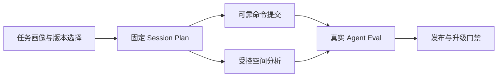
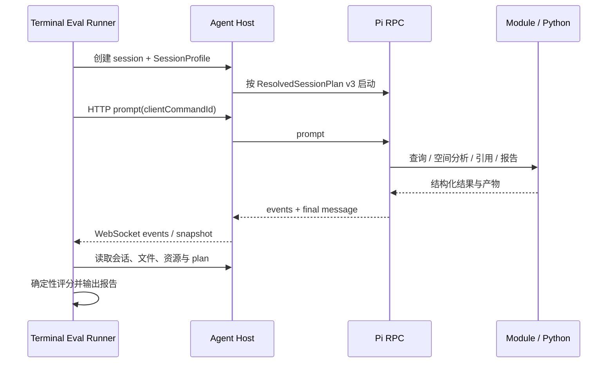
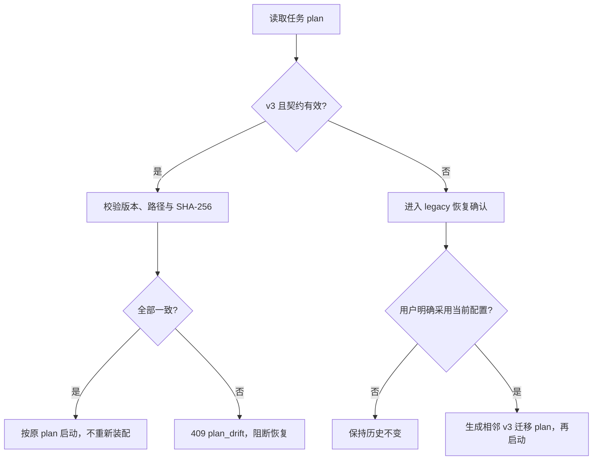

# TransportX Traffic Agent 可靠性与空间分析修复 SPEC

- 状态：Implemented
- 日期：2026-08-13
- 实施完成：2026-08-14
- 目标版本：3.x 后续迭代
- 范围：问题 1、2、3、5、6
- 不在范围：问题 4（`TrafficAnalysisJob` 或同类通用分析作业协议）

## 实施结果

本 SPEC 中问题 1、2、3、5、6 已完成开发：

- 问题 1：新增 25 道原始问答、3 道空间题和 3 个完整任务的机器可读 Eval suite，以及真实 Agent Host + Pi RPC 的 Headless Terminal runner、确定性评分器与结果归档。
- 问题 2：`ResolvedSessionPlan v3` 固定 Module、入口、资产和完整性哈希；恢复时严格校验，旧 plan 必须由用户确认后才使用当前配置派生 v3。
- 问题 3：Prompt、Steer、Follow-up、Abort 和 Extension UI Response 统一改为带 `clientCommandId` 的 HTTP 可靠提交；服务端 ledger 去重，WebSocket 仅承载事件，pending UI 可恢复。
- 问题 5：新增 `SessionProfile v1`、全版本 Module catalog 和精确版本选择；新建任务支持名称、类型、预期交付、城市/项目/时空范围和资产完整性状态。
- 问题 6：新增受控 Spatial Analysis capability，实现 `buffer`、`nearest`、`spatial_join` 与 `SpatialAnalysisResult v1`，校验 CRS、会话路径、输入限额、输出哈希和 unmatched/multiple 语义。

实施验证：`npm run typecheck`、`npm test`（70 项）、React smoke、Desktop smoke 和 Pi RPC smoke 通过；Headless fake-Pi 端到端通过；真实 `deepseek/deepseek-v4-flash` + Shanghai Data 运行 `SH-001` 通过 1/1，包含正确事实、单位、plan v3 和 dataset citation。整套真实模型运行仍应在发布候选时执行，避免将持续的模型费用混入日常单元回归。

## 1. 文档目的

本 SPEC 将以下五项问题转化为可实施、可测试、可分阶段交付的修复方案：

- **问题 1**：上海交通问答题库目前只是文档，不能持续验证 Agent 的真实分析能力。
- **问题 2**：历史会话恢复时会重新装配当前模块，无法保证与创建时的数据、知识和能力版本一致。
- **问题 3**：Prompt、Abort、追问和 Extension UI 回答通过 WebSocket 尽力发送，断线时可能静默丢失。
- **问题 5**：新建交通任务时只能选择模型，不能固定任务范围及 Data / Knowledge Module 版本。
- **问题 6**：地图能力只负责可视化，Agent 缺少受控、可复核的空间分析工具与结果契约。

本轮不重写 Agent Host，不拆分微服务，不引入通用消息队列，也不建设问题 4 所描述的通用分析作业系统。所有改动继续遵守现有的“共享契约 → Node Agent Host → Browser Kernel → React”边界。

## 2. 交通应用中的实际需求

交通分析与普通聊天的差异不在于回答更长，而在于结果必须满足以下约束：

- **口径稳定**：公交交易、轨交人次、网约车订单或端点事件、道路状态持续时间不能混算。
- **时空范围明确**：日期、小时区间、空间范围、统计对象必须可追溯。
- **数据版本固定**：同一历史任务不应因为数据模块或知识库升级而得到另一套解释。
- **交互不可假成功**：用户看到“已发送”或“已回答”时，Agent Host 必须已经明确接收。
- **空间过程可复核**：缓冲、最近邻、空间连接不能只存在于模型生成的临时代码中，参数、输入、输出和异常记录都应结构化保存。
- **回归可量化**：升级模型、Prompt、Skill、Extension、数据或知识后，应能判断能力是提升还是退化。

因此，本 SPEC 的核心不是增加更多聊天功能，而是建立一条最小闭环：



## 3. 当前基线与问题证据

### 3.1 已具备的基础

- 项目已有 25 道上海交通真实问题及标准答案：[`shanghai-data-question-bank.md`](shanghai-data-question-bank.md)。
- Module 已按 `modules/<id>/<version>` 保存多个安装版本。
- 会话创建时会生成 `.tau/resolved-session-plan.json`。
- Browser 已有 HTTP `/api/rpc` 命令入口和 WebSocket 实时事件入口。
- Agent Host 本身可在非 Desktop 模式运行，并支持 `TAU_USER_DATA_DIR`、`TAU_MODULE_MANIFESTS`、数据资产路径和 Pi session 目录隔离，具备 Headless Eval 基础。
- Agent Host 已有带超时、取消和输出上限的 `PythonRunner`。
- Python 运行时已有 `pandas`、`pyproj`、`shapely`，足以实现第一阶段空间算子。
- Geo Module 已提供 `publish_geodata` 与声明式地图展示，但明确不承担数据分析。

### 3.2 当前缺口

| 编号 | 当前实现 | 直接后果 |
|---|---|---|
| 1 | 题库只有 Markdown 问题和答案，没有机器可读用例、真实会话执行器、评分规则和结果归档 | 模型、Prompt、Skill、数据升级后无法量化回归 |
| 2 | `LiveSessionManager.resume()` 重新调用 `SessionAssembler.assemble()`，并覆盖保存的 plan | 历史任务会悄悄使用当前模块与资产，结果不可复现 |
| 3 | `WebSocketClient.send()` 断线时只记录日志；调用方仍写入“已发送”或清除交互框 | UI 与 Pi 状态分叉，任务可能永久等待用户回答 |
| 5 | `NewSessionDialog` 只提交模型；`SessionAssembler` 自动加入所有全局启用的用户模块且只取最新版本 | 用户无法说明“本任务使用哪套数据/知识与分析范围” |
| 6 | Geo Module 只验证和展示 GeoJSON；空间计算依赖 Agent 临时编写脚本 | 算法、CRS、阈值和丢弃记录不稳定，也难以测试 |

此外，`npm run typecheck` 与 `npm test` 当前通过；`npm run test:react-smoke` 在新建任务模型单选控件处存在点击拦截失败。涉及新建任务 UI 前，必须先修复该 smoke 基线，否则无法区分既有失败与本轮回归。

## 4. 总体目标与非目标

### 4.1 目标

- 将 25 道题转为真实 Pi 会话可执行、可重复、可机器评分的 Agent Eval。
- 新任务明确保存任务画像和选定的 Module 精确版本。
- 历史任务只按创建时的固定 plan 恢复；不满足条件时明确阻断并给出恢复建议。
- 所有关键用户命令只有在 Agent Host 确认后才进入“已发送/已解决”状态。
- 提供缓冲、最近邻、空间连接三个受控空间算子及统一结果契约。
- 五项能力具备单元、集成和 UI smoke 验收，不依赖人工感觉判断完成度。

### 4.2 非目标

- 不实现问题 4 的 `TrafficAnalysisJob`、通用作业队列、步骤 DAG 或统一分析产物生命周期。
- 不将 WebSocket 替换为完整消息中间件，不建立跨重启持久化 outbox。
- 不归档或复制整套大体积数据库到每个任务目录。
- 不在第一阶段实现路网最短路径、地图匹配、热点识别、OD 推断、交通预测或实时流处理。
- 不引入 GeoPandas、PostGIS、Spatialite 等新依赖；第一阶段使用现有 Shapely / PyProj。
- 不让前端直接执行 Agent 生成的任意 Python、SQL、JavaScript 或 MapLibre 配置。
- 不用 LLM-as-a-judge 作为第一阶段硬门禁；先采用可解释的确定性评分。

## 5. 设计原则

1. **创建时解析，恢复时校验**：恢复不能再次做“选择最新版本”这类决策。
2. **确认后再乐观展示**：发送失败不能伪装成业务成功。
3. **精确版本属于 Module**：Data / Knowledge 的版本先由所属 Module 版本表达，不另造第二套资产版本体系。
4. **全局启用是可用性策略，任务选择是执行事实**：两者不能混为一谈。
5. **空间分析与地图展示分离**：空间工具生成可验证结果，现有 Geo Module 负责发布与呈现。
6. **小契约优先**：只增加本轮必要的 `SessionProfile`、`ResolvedSessionPlan v3`、`ReliableCommand`、`SpatialAnalysisResult`。

---

## 6. 修复项 1：真实 Traffic Agent Eval

### 6.1 当前问题

[`shanghai-data-question-bank.md`](shanghai-data-question-bank.md) 适合人工阅读，但缺少：

- 机器可读的题目 ID、数据范围和标准字段；
- 真实 Pi 会话执行过程；
- 对工具错误、口径错误、时间范围错误和臆造结果的判定；
- 重复运行、模型对比和版本对比；
- 统一的结果文件和发布门禁。

现有 `test:pi-smoke` 验证的是 Pi RPC 协议与生命周期，不验证 Agent 是否会正确分析交通数据，二者不能互相替代。

### 6.2 解决方案

新增独立的 Eval 目录，保留 Markdown 题库作为人类说明，机器执行以 JSON fixture 为权威。评测分为两层：

- **Headless Terminal E2E（主评测）**：不启动 Electron 和 React，由终端 runner 作为客户端，通过真实 Agent Host API 完整创建任务、发送多轮请求、等待 Pi、检查工具和产物。
- **Desktop / React Smoke（补充评测）**：只验证任务创建、状态展示、地图和交互恢复等 UI 行为，不重复承担语义正确性评分。

Headless 不等于绕过平台。Runner 不能直接调用模型 SDK 或直接执行题目 SQL，必须经过与桌面相同的 SessionAssembler、Pi RPC、Module、Skill、Extension、Python 和会话文件链路。

目录结构：

```text
evals/
  traffic-agent/
    shanghai-v1.json
    README.md
scripts/eval/
  run-traffic-agent-eval.mjs
  grade-traffic-agent-eval.mjs
test/fixtures/eval/
  completed-session.jsonl
```

建议的单题结构：

```ts
type TrafficEvalCaseV1 = {
  id: string;
  kind: 'question' | 'task';
  category: 'bus' | 'metro' | 'ride-hailing' | 'road' | 'weather' | 'spatial';
  turns: Array<{
    user: string;
    expected?: {
      facts?: Array<{
        label: string;
        value: string | number;
        tolerance?: number;
        unit?: string;
      }>;
      requiredTerms?: string[];
      forbiddenTerms?: string[];
      timeRange?: string;
    };
  }>;
  requiredModuleVersions: Array<{ id: string; version: string }>;
  expectedArtifacts?: Array<{
    kind: 'table' | 'geojson' | 'report' | 'spatial-result';
    pathPattern: string;
    contract?: string;
  }>;
  grading: {
    requireSuccessfulTurn: true;
    requireNoToolError: true;
    requireDatasetCitation?: boolean;
  };
};
```

第一版将现有 25 题逐题转录为 `kind: question`，不能在运行时解析 Markdown 表格。Markdown 与 JSON 的题目 ID 必须一一对应，由测试校验数量和 ID，避免两份内容漂移。

同时新增少量 `kind: task` 的终端完整任务场景。它们不是再增加一批简单问答，而是检查 Agent 能否完成“理解范围 → 选择工具 → 查询与计算 → 校验 → 生成产物 → 引用 → 最终说明”的完整链路。第一批建议覆盖：

1. 对一个演出日完成场馆周边公交、轨交、道路和天气联合分析，输出结论表与引用。
2. 完成场馆缓冲区、最近轨交站和道路空间连接，输出 GeoJSON、空间结果 manifest 和地图资源。
3. 在给定时空范围内形成交通保障分析报告，检查报告、数据引用和关键口径说明。

完整任务仍使用本 SPEC 中的现有 Session / Task / Geo / Citation 能力，不引入问题 4 的 `TrafficAnalysisJob`。

### 6.3 Headless Terminal E2E 模式

终端 runner 启动构建后的真实 Agent Host 子进程，并使用生产 HTTP / WebSocket 协议驱动任务：



运行隔离：

- Agent Host 只监听 `127.0.0.1` 的临时端口，不打开浏览器。
- `TAU_USER_DATA_DIR`、`PI_CODING_AGENT_SESSION_DIR` 和任务工作区使用本次运行的临时目录。
- 模型配置和凭据可以只读复用显式指定的 `PI_CODING_AGENT_DIR`；结果与会话不能写回真实用户目录。
- `TAU_MODULE_MANIFESTS` 显式指向评测所需 Module 版本，Data / Knowledge 资产通过显式资产路径注入；不能使用“当前最新版本”的隐式发现。
- Runner 捕获 SIGINT / SIGTERM，先关闭 live session，再终止 Agent Host；失败时保留可选的诊断目录。
- 单个 case 有任务级超时；超时要保存已完成事件、Pi stderr 摘要和工作区文件清单。

完整任务完成的判定至少同时检查：

- 所有 turn 正常结束，且没有未处理的 Extension UI request；
- 最终回答满足事实、口径、单位、时间和空间范围断言；
- 预期的 CSV / GeoJSON / report / spatial manifest 实际存在并通过对应契约；
- 数据集、知识或任务产物需要引用时，存在有效 Citation occurrence；
- plan 中的平台、模型、Module、数据和知识版本与 case 要求一致；
- 会话没有 tool error、路径逃逸、超限或未解释的过滤记录。

### 6.4 执行流程

每个用例都使用独立新会话，防止前题上下文污染后题：

1. 创建临时 `TAU_USER_DATA_DIR`，不读取或污染用户真实会话。
2. 检查指定模型、Shanghai Data 精确版本和必需资产是否可用。
3. 启动非 Desktop Agent Host，通过 session API 使用与桌面相同的 SessionAssembler、Prompt、Skill 和 Extension 启动真实 Pi RPC。
4. 按 `turns` 发送自然语言请求，等待每轮 `turn_end` / `agent_end`，收集最终回答和完整工具轨迹。
5. 运行确定性评分器，输出每个断言的通过或失败原因。
6. 保存运行元数据、固定 plan、回答、工具轨迹摘要、耗时、token 和费用信息。

输出目录不入 Git：

```text
eval-results/<timestamp>/
  run.json
  summary.json
  summary.md
  cases/<case-id>.json
```

### 6.5 评分规则

第一阶段采用可解释的确定性规则：

- 日期、站点、线路、路段和数值精确匹配；允许显式声明的数值误差。
- 单位必须匹配，例如秒、km/h、mm、°C、笔、人次不能互换。
- 时间范围必须匹配，尤其是 `17:00—17:59`、`22:00—24:00` 等边界。
- 对适用题目检查数据集引用或查询依据。
- 任一工具失败、Pi 非正常退出、最终回答为空，均判为执行失败。
- 出现禁止口径，例如跨交通类型直接相加，判为口径失败。
- 延迟、token 和费用先报告，不作为第一版硬失败条件。
- `kind: task` 额外检查多轮完成率、预期产物契约、引用闭环和工作区残留错误。

数值命中但过程使用错误数据版本时仍判失败；因此 Eval 必须读取本次会话的 `ResolvedSessionPlan v3`，不能仅检查最终文本。

### 6.6 命令与门禁

新增脚本：

```json
{
  "eval:traffic": "npm run build && node scripts/eval/run-traffic-agent-eval.mjs --mode headless",
  "eval:traffic:tasks": "npm run build && node scripts/eval/run-traffic-agent-eval.mjs --mode headless --kind task",
  "eval:traffic:grade": "node scripts/eval/grade-traffic-agent-eval.mjs"
}
```

建议的终端使用方式：

```bash
npm run eval:traffic -- --model <provider/model> --suite shanghai-v1 --repeat 3
npm run eval:traffic -- --case <case-id> --keep-workspace
npm run eval:traffic:tasks -- --model <provider/model>
```

`eval:traffic` 不并入默认 `npm test`，因为它需要真实模型、凭据和数据；发布候选版本必须在指定模型上运行。CI 如果没有模型凭据，只运行 fixture parser、grader 和 fake Pi 的确定性测试，不得把未运行真实 Eval 显示为通过。

第一阶段发布门禁：

- 25/25 用例完成，无 Pi 或工具执行错误；
- 终端完整任务场景全部完成，预期产物契约与引用通过；
- 所有核心事实、单位、时间范围通过；
- 禁止口径命中数为 0；
- 连续 3 次运行报告一致率，核心事实一致率必须为 100%；
- 结果记录模型、Prompt、平台、Module 与数据资产版本。

### 6.7 验收测试

- Fixture parser 拒绝重复 ID、未知 schema、无单位数值和缺失 Module 版本。
- Grader 对数值格式差异可归一化，但不把单位或统计对象差异当作正确。
- fake Pi 用例验证超时、工具失败、空回答、错误口径均能被正确分类。
- 真实上海数据运行生成完整 `summary.json` 和 `summary.md`。
- 关闭 Electron / React 后，Headless runner 仍可从终端独立完成 session create → 多轮 prompt → tool → artifact → final answer → close。
- Headless 与桌面使用同一 profile 和 Module 版本时，plan 投影与核心语义结果一致；不要求 UI 事件或渲染结果完全相同。

---

## 7. 修复项 2：历史会话固定版本恢复

### 7.1 当前问题

当前会话创建和恢复都会调用 `SessionAssembler.assemble()`。恢复时不仅没有读取已保存的 plan，还会用当前启用模块重新生成并覆盖 `.tau/resolved-session-plan.json`。

这会产生三类不可见变化：

- Shanghai Data 或 Knowledge Module 升级后，历史问题使用了新数据；
- Skill / Extension 改变后，历史会话的工具和提示词语义改变；
- 已禁用、缺失或替换的模块被自动跳过或换成最新版本。

此行为与“历史解释不随升级变化”的架构目标冲突。

### 7.2 `ResolvedSessionPlan v3`

新增共享契约与严格 parser：

```ts
type ResolvedSessionPlanV3 = {
  schemaVersion: 3;
  platform: { name: 'TransportX Traffic Agent'; version: string };
  profile: SessionProfileV1;
  domain: { id: string; version: string };
  modules: Array<{
    id: string;
    version: string;
    type: 'module' | 'capability' | 'domain';
    origin: 'builtin' | 'installed' | 'external';
    packageRoot: string;
    manifestSha256: string;
    entrypoints: Array<{ kind: 'prompt' | 'skill' | 'extension'; path: string; sha256: string }>;
  }>;
  assets: Array<{
    id: string;
    kind: 'knowledge' | 'data' | 'template';
    moduleId: string;
    moduleVersion: string;
    path: string;
    integrityFile?: string;
    integrityFileSha256?: string;
    integrityStatus: 'verified' | 'unverified';
  }>;
  runtime: { piVersion?: string; pythonVersion?: string };
  workspace: string;
  createdAt: string;
};
```

`piExtensions`、`skills` 和 `promptPath` 不再作为无法追溯来源的平铺字符串保存，而由各 Module 的 `entrypoints` 派生；启动 Pi 前可继续投影为现有参数。

### 7.3 完整性策略

- Module 安装目录仍保持不可覆盖的 `<id>/<version>` 结构。
- plan 保存 Module manifest 与实际加载的 Prompt / Skill / Extension SHA-256。
- Knowledge / Data 资产必须提供 `integrityFile` 才能标记为 `verified`。
- `com.transportx.shanghaidata` 需补充数据库资产 checksum 文件，并在 manifest 中声明 `integrityFile`。
- 旧的第三方 Module 没有 checksum 时可以创建任务，但 UI 和 plan 必须显示“未验证”；发布 Eval 所用 Module 必须全部为 `verified`。
- 恢复前检查精确 Module 版本、入口文件 hash 和资产 checksum。为避免重复扫描大文件，可按真实路径、size、mtime 缓存验证结果；Agent Host 重启后的首次恢复仍需重新校验。

本方案保证“发现漂移并阻断”，不承诺在用户删除旧 Module 或数据库后自动恢复其内容。

### 7.4 创建与恢复状态机

新建任务：

1. 解析 `SessionProfileV1` 的精确 Module 版本。
2. 构建每会话 registry 和 resolver。
3. 生成并校验 `ResolvedSessionPlan v3`。
4. 使用临时文件 + rename 原子写入 `.tau/resolved-session-plan.json`。
5. plan 保存成功后才启动 Pi。

恢复任务：



禁止行为：

- 不允许在普通 resume 中调用“所有全局启用模块 + 最新版本”的隐式装配。
- 不允许静默覆盖已有 v3 plan。
- 不允许 Module 或资产不匹配时只弹警告后继续启动。

### 7.5 Legacy 兼容

旧任务无法被事后证明为完全可复现，必须如实处理：

- v2 plan 或无 plan：API 返回 `409 legacy_plan_requires_confirmation`。
- UI 显示当时记录与当前可用配置的差异，并提供“取消”或“采用当前配置恢复”。
- 用户明确确认后，保留原文件，另写 `.tau/resolved-session-plan.v3.json`；后续 loader 优先使用该 v3 文件。
- 如用户不想改变历史语义，可创建“以当前配置派生新任务”，原会话文件和工作区不变。
- v3 plan 漂移或缺失时，不提供原地“换成最新版本”；只允许安装精确版本，或派生新任务。

### 7.6 结构化错误

```ts
type SessionPlanConflict = {
  error: 'session_plan_conflict';
  code:
    | 'legacy_plan_requires_confirmation'
    | 'module_version_missing'
    | 'module_content_mismatch'
    | 'asset_missing'
    | 'asset_integrity_mismatch'
    | 'runtime_incompatible';
  recoverable: boolean;
  details: Array<{
    moduleId?: string;
    expected?: string;
    actual?: string;
    path?: string;
  }>;
};
```

### 7.7 验收测试

- 新建任务生成 v3 plan，且写入发生在 Pi spawn 之前。
- 安装新版本后恢复旧任务，仍加载旧版本入口和资产。
- 修改入口文件、删除旧版本、篡改数据库任一情况都返回明确 409，且不启动 Pi。
- 恢复成功不修改 plan 的 bytes 和 mtime。
- v2 / 无 plan 默认不恢复；明确确认后保留旧文件并生成相邻 v3。
- Windows 与 macOS 路径均通过统一 realpath / within-root 校验。

---

## 8. 修复项 3：关键命令可靠交付

### 8.1 当前问题

当前 Prompt、Task Mode、Abort、Steer、Follow-up 和 `extension_ui_response` 直接调用 WebSocket `send()`：

- socket 非 OPEN 时只输出 `console.error`；
- `sendPrompt()` 随后立即 dispatch `promptSent`；
- Extension UI 随后立即 dispatch `resolved`；
- 重连快照不包含正在等待的 Extension UI 请求；
- streaming 期间的 queued prompt 在 flush 时也会先移除再假定发送成功。

因此“浏览器调用了 send”被错误地等同为“Agent Host 已接受命令”。

### 8.2 传输职责调整

复用现有 `/api/rpc`，不增加第二套 RPC 服务：

- **HTTP `/api/rpc`**：所有有副作用的用户命令，返回明确 ACK 或错误。
- **WebSocket**：服务端到浏览器的实时事件、会话更新和诊断；不再承担用户命令提交。

迁移命令：

- `prompt`
- `steer`
- `follow_up`
- `abort`
- Task Mode 的 `/task on|off --silent`
- `extension_ui_response`

已有通过 HTTP 的 model、compact、settings 命令保持不变。

### 8.3 命令 ID 与去重

```ts
type ReliableRpcCommand = RpcCommand & {
  clientCommandId: string;
};

type ReliableRpcAck = {
  type: 'response';
  success: true;
  command: string;
  clientCommandId: string;
  delivery: 'accepted';
  acceptedAt: string;
};
```

- Browser 使用 `crypto.randomUUID()` 生成 `clientCommandId`，重试同一逻辑命令时必须复用。
- Agent Host 维护每会话有界 receipt ledger，例如最近 200 条或 10 分钟，以先到者为准。
- 同一 `clientCommandId` 并发到达时共享同一个 in-flight Promise；完成后返回缓存 ACK / error，不重复写入 Pi stdin。
- `extension_ui_response` 额外按 `sessionId + requestId` 去重，已回答或已过期请求返回结构化冲突，不再次提交。
- 不对 delivery 状态未知的 Prompt 自动生成新 ID 重试，避免模型收到重复消息。

`accepted` 的定义是 Agent Host 已验证命令，并收到 Pi RPC 对应响应。当前对 prompt / abort / UI response 的 RPC timeout 直接转换为 success 的逻辑必须删除；超时返回 `delivery_unknown`，UI 不得标记为已发送。

### 8.4 Browser 状态语义

Prompt 最小状态：

```ts
type OutgoingPromptState =
  | { status: 'queued'; clientCommandId: string }
  | { status: 'sending'; clientCommandId: string }
  | { status: 'accepted'; clientCommandId: string }
  | { status: 'failed'; clientCommandId: string; retryable: boolean; message: string }
  | { status: 'delivery_unknown'; clientCommandId: string; message: string };
```

- 只有收到 ACK 后才 dispatch `promptSent` / `extensionUi.resolved`。
- HTTP 失败时保留输入、附件引用和 Extension UI dialog，显示可操作错误。
- streaming 队列中的 prompt 必须逐条 `await` ACK；成功一条移除一条，第一条失败即停止 flush。
- `delivery_unknown` 不自动重发；用户可以先同步会话状态，再使用同一 ID 查询或重试。

这不是通用持久化 outbox。刷新页面后未被 Host 接受的普通输入可以丢失，但 UI 不得声称其已成功；已由 Host 接收的事件由会话历史恢复。

### 8.5 Pending Extension UI 恢复

Agent Host 在 `PiRpcSession` 中跟踪尚未回答的 `extension_ui_request`：

- 收到 request event 时按 request ID 保存；
- 回答成功、明确取消、会话结束时清除；
- `live_session_snapshot` 返回 `pendingExtensionUiRequests`；
- Browser hydrate / reconnect 时重新写入现有 `ExtensionUiStore`，按 request ID 去重；
- 回答过期或重复时服务端返回 409，Browser 重新拉取 snapshot 后关闭或更新 dialog。

第一阶段只保存当前 live session 内存状态，不跨 Agent Host 进程重启恢复 Pi 内部正在等待的请求；进程重启会导致原 Pi 会话本身中断，不在本项扩展为持久任务系统。

### 8.6 验收测试

测试矩阵必须覆盖：

| 场景 | 预期 |
|---|---|
| WebSocket CLOSED，但 HTTP 正常 | Prompt 仍通过 HTTP 提交并得到 ACK |
| HTTP 不可达 | 不产生 `promptSent`，输入保留并显示失败 |
| ACK 丢失后以相同 ID 重试 | Pi 只接收一次 |
| Pi RPC timeout | 返回 `delivery_unknown`，不伪装 success |
| UI response 提交失败 | Dialog 保留 |
| 重连后有 pending request | 同一 request 重新显示一次 |
| 同一 UI response 重复提交 | 服务端至多向 Pi 写入一次 |
| queued prompt 第二条失败 | 第一条移除，第二条及后续保留 |

单元测试之外，`react-smoke` 需要增加断线、重连、重复点击和回答失败场景。

---

## 9. 修复项 5：任务级分析画像与 Module 版本选择

### 9.1 当前问题

当前新建任务只选择名称、目录和模型。实际会话能力由全局 `enabledModuleIds` 以及安装目录中的“最新版本”决定。对于交通应用，这缺少三个关键事实：

- 用户本次要做数据查询、空间分析、保障方案还是报告；
- 时间范围和空间范围是什么；
- 本次使用 Shanghai Data、交通保障知识库等哪个精确版本。

全局“启用模块”适合表达管理员允许哪些能力可用，不适合表达一个具体历史任务实际使用了什么。

### 9.2 `SessionProfile v1`

```ts
type SessionProfileV1 = {
  schemaVersion: 1;
  task: {
    kind: 'data-query' | 'spatial-analysis' | 'assurance-analysis' | 'report';
    city?: string;
    project?: string;
    timeRange?: {
      start: string;
      end: string;
      timezone: string;
    };
    spatialScope?: {
      label: string;
    };
    expectedOutputs: Array<'answer' | 'table' | 'map' | 'report'>;
  };
  modules: {
    selectionMode: 'explicit' | 'compat-default';
    selected: Array<{
      id: string;
      version: string;
    }>;
  };
};
```

约束：

- `timeRange.start <= timeRange.end`，timezone 使用 IANA 名称。
- `selected` 中每个 Module ID 只出现一次。
- 内置 domain / capability 由平台隐式加入，不要求用户手选。
- 用户 Module 必须同时满足：已安装、全局允许、平台版本兼容。
- Data / Knowledge 版本由 Module 版本固定。例如选择 `com.transportx.shanghaidata@2.0.1` 即固定其声明的数据资产；第一阶段不允许在同一 Module 版本下再选“资产版本别名”。
- 任务画像是分析上下文和审计信息，不替代自然语言问题，也不自动生成问题 4 的分析作业。

### 9.3 Module 版本目录

现有 `ModuleInstaller.sources()` 只返回每个 Module 的最新版本。新增只读目录能力：

```ts
type ModuleCatalogEntry = {
  id: string;
  name: string;
  version: string;
  type: 'module' | 'capability' | 'domain';
  origin: 'installed';
  enabledForNewSessions: boolean;
  compatible: boolean;
  dependencies: string[];
  assets: Array<{
    id: string;
    kind: 'data' | 'knowledge' | 'template';
    configured: boolean;
    integrity: 'verified' | 'unverified' | 'missing';
  }>;
};
```

`ModuleInstaller.catalog()` 枚举所有已安装版本；`sourcesForSelections()` 只解析 profile 指定版本。不要把全局 `ModuleRegistry` 的 key 改成 `id@version`：每个会话创建一个短生命周期 registry，其中同一 Module ID 只出现一个版本，即可复用现有依赖排序和 AssetResolver。

依赖解析规则：

- builtin 依赖由平台自动满足；
- 用户 Module 依赖另一个用户 Module 时，前端可以提示并联动选择，服务端仍做最终校验；
- 未指定依赖版本时服务端不能擅自选最新版本，应返回候选版本让用户确认；
- 重复 asset ID、依赖环或平台不兼容均在启动 Pi 前返回字段级错误。

### 9.4 API 变化

新增：

- `GET /api/platform/session-options`：返回模型之外的新任务 Module 全版本目录和预设。

扩展：

- `POST /api/live-sessions` 接收 `profile: SessionProfileV1`。
- `LiveSession.metadata()` 返回 profile 摘要和 plan 验证状态，不返回 API Key 或知识库绝对路径。

兼容策略：

- 新 React UI 总是提交 `selectionMode: explicit`。
- 旧客户端暂时可以省略 profile；服务端将当前全局选择固化成 `compat-default` profile 并写入 v3 plan，同时返回 deprecation diagnostic。
- 一个小版本周期后，可根据真实兼容需求决定是否移除 `compat-default`，本 SPEC 不提前删除。

### 9.5 新建任务 UI

`NewSessionDialog` 调整为两层：

必填区：

- 任务名称；
- 模型；
- 任务类型；
- 数据 / 知识 Module 及版本；
- 期望输出。

可选“分析范围”区：

- 城市 / 项目；
- 开始与结束时间；
- 空间范围文字，例如“上海体育场周边 2 km”。

UI 行为：

- 默认只显示全局允许且兼容的 Module；可展开查看已安装旧版本。
- 明确展示 Data / Knowledge 资产是否配置、是否经过完整性校验。
- 提交前展示一行摘要，例如“上海数据 2.0.1 + 保障知识 1.0.0；2025-08-21；地图 + 报告”。
- Module 缺失、资产未配置、依赖未选或版本不兼容时禁用创建，并显示具体原因。
- 不把全部 Module 管理功能复制到新建弹窗；安装、启用、卸载仍留在能力管理区。

### 9.6 卸载和历史影响

- 仍在 live session 中使用的 Module 精确版本不得卸载。
- 卸载整个 Module 前，UI 必须提示“历史任务可能无法原样恢复”。
- 不扫描并复制所有历史数据库来阻止卸载；若用户删除旧版本，历史恢复按第 7 节返回 `module_version_missing`。
- 后续如确有合规归档需求，应另立“任务归档包”SPEC，不在本轮复制大数据资产。

### 9.7 验收测试

- 安装同一 Module 两个版本，目录 API 同时返回两者。
- 新任务选择旧版本时，plan 和 Pi 参数均使用旧版本。
- 全局禁用 Module 后，新任务不能选择；已创建 live session 不受影响。
- 缺少用户依赖版本时创建失败，服务端不隐式选 latest。
- 旧客户端省略 profile 时生成 `compat-default` v3 plan 和诊断。
- React smoke 覆盖显式版本选择、依赖提示、资产缺失和摘要展示。

---

## 10. 修复项 6：独立空间分析 Module 与结果契约

### 10.1 当前问题

现有 Geo Module 的职责是：

1. 验证并发布已生成的 GeoJSON；
2. 构建受控的声明式地图；
3. 恢复地图 revision。

它不查询、不聚合、不进行空间运算。当前 Agent 如果要做“体育场周边 2 km 路段”“每个场馆最近的轨交站”“点落在哪个街道”，只能临时生成 Python。常见失败包括：

- 在经纬度上直接按度缓冲；
- CRS 缺失或错误转换；
- 最近邻距离单位不明确；
- spatial join 产生多重匹配但回答未说明；
- 输入要素被过滤、空几何或无效几何未记录；
- 结果文件与最终回答之间没有结构化关联。

### 10.2 Module 边界

新增内置 capability：

```text
modules/capabilities/spatial-analysis/
  manifest.json
  extensions/pi-spatial-analysis/index.ts
  skills/SKILL.md
  scripts/spatial_analysis.py
```

建议 manifest：

- ID：`com.transportx.spatial-analysis`
- type：`capability`
- dependency：`com.transportx.geo`
- tool：`tau_spatial_analyze`
- workbench domain 增加该 capability 依赖

空间分析 Module 负责“分析并生成受控结果”；现有 Geo Module 继续负责“发布并显示结果”。工具成功后返回相对 GeoJSON 路径，Agent 如需地图再调用 `publish_geodata`，不在空间工具内部直接操控前端。

### 10.3 第一阶段算子

仅实现三个交通分析高频算子：

#### A. `buffer`

- 输入：一个 GeoJSON FeatureCollection。
- 参数：`distanceMeters`、`inputCrs`、`metricCrs`、可选 dissolve。
- 规则：必须显式传入 `inputCrs` 和适合本地量距的 `metricCrs`；禁止在 EPSG:4326 坐标上直接缓冲。
- 输出：WGS84 GeoJSON 面结果。

#### B. `nearest`

- 输入：left 与 right 两个 GeoJSON FeatureCollection。
- 参数：两侧 CRS、`metricCrs`、可选 `maxDistanceMeters`、需要复制的 right 属性。
- 输出：每个 left 要素的最近 right ID、距离米数和匹配状态。
- 超出阈值时保留 left 记录并标记 unmatched，不静默丢弃。

#### C. `spatial_join`

- 输入：left 与 right 两个 GeoJSON FeatureCollection。
- 参数：`intersects | within | contains`、one-to-one 或 one-to-many、需要复制的字段。
- 输出：匹配结果和匹配计数。
- one-to-one 遇到多个匹配时必须按显式策略处理或报错，不能随遍历顺序任选一个。

热点、OD、路径、地图匹配等后续能力只有在真实 Eval 用例证明需要后再新增。

### 10.4 工具调用与 Host 边界

Extension 不直接拼 shell 命令。沿用 Citation Extension 的 Host bridge 模式：

1. `tau_spatial_analyze` 通过 TypeBox 校验参数。
2. Extension 使用当前 session ID、内部 endpoint 和随机 token 调用 `POST /api/internal/spatial/analyze`。
3. Agent Host 验证 token 和 live session。
4. Host 将输入路径解析为 session cwd 内的 realpath，拒绝绝对路径、symlink 逃逸和非 GeoJSON 文件。
5. Host 使用现有 `PythonRunner` 调用唯一受控脚本 `spatial_analysis.py`。
6. Python 输出 `SpatialAnalysisResult v1` JSON；Host 再次解析契约、校验输出路径和 hash 后返回 Extension。

内部 endpoint 与 token 仅注入当前 Pi 子进程，不暴露到 Browser；可以复用 session 内部 token 的生成与校验方式，但应使用空间服务独立的环境变量名，避免把 citation 权限语义扩大。

### 10.5 `SpatialAnalysisResult v1`

```ts
type SpatialAnalysisResultV1 = {
  protocol: 'transportx-spatial-analysis';
  schemaVersion: 1;
  analysisId: string;
  operation: 'buffer' | 'nearest' | 'spatial_join';
  inputs: Array<{
    role: 'input' | 'left' | 'right';
    relativePath: string;
    sha256: string;
    crs: string;
    featureCount: number;
  }>;
  parameters: Record<string, string | number | boolean>;
  counts: {
    input: number;
    output: number;
    unmatched: number;
    invalidGeometry: number;
    emptyGeometry: number;
  };
  output: {
    relativePath: string;
    sha256: string;
    crs: 'EPSG:4326';
    geometryTypes: string[];
    featureCount: number;
  };
  warnings: string[];
  durationMs: number;
  createdAt: string;
};
```

结果保存：

```text
analysis/spatial/<analysis-id>/result.geojson
.tau/spatial-results/<analysis-id>/manifest.json
```

- `result.geojson` 位于任务工作区，可被现有 `publish_geodata` 使用。
- `manifest.json` 保存结构化过程和 hash，供历史审计、引用和 Eval 使用。
- 这只是空间工具结果，不升级为通用 `AnalysisJob`。

### 10.6 资源限制和安全

第一阶段建议限制：

- 单个输入不超过 100 MiB；
- 单个输入不超过 50,000 features；
- 最大输出 50,000 features / 100 MiB；
- 默认超时 120 秒；
- stdout / stderr 延续 `PythonRunner` 4 MiB 上限；
- 所有 geometry 必须是合法 GeoJSON；对无效 geometry 默认报错，可选 `repairInvalid: true` 时记录修复数量；
- 属性白名单复制，避免把大字段和敏感字段无条件写入结果；
- 输出目录由 Host 创建，Python 只接收 Host 解析后的输入与输出路径。

CRS 规则：

- 距离算子必须显式提供 metric CRS。
- 输出统一转换到 EPSG:4326，便于现有 Geo Module 发布。
- 结果必须记录原始 CRS、metric CRS、距离单位和转换警告。
- Skill 可以为上海案例推荐合适投影，但工具契约不能把上海 CRS 硬编码成平台全局默认。

### 10.7 Agent Skill 指引

Skill 只包含可执行规则：

- 何时应使用空间工具，而不是文本筛选或自行按经纬度计算；
- 如何选择和声明 CRS；
- 如何解释 unmatched、multiple match、invalid geometry；
- 如何先分析、再 `publish_geodata`、最后回答；
- 最终回答必须说明距离、谓词、阈值、输入范围和异常数量。

Skill 不复制 Shapely 教程，不鼓励 Agent 生成替代实现。

### 10.8 验收测试

- 契约 parser 拒绝未知 operation / schema、绝对路径和非法计数。
- 使用固定小型 GeoJSON fixture 验证 buffer 面积/范围、nearest 距离和 join 匹配数。
- EPSG:4326 直接量距、缺少 metric CRS、cwd 逃逸、symlink、超限输入均被拒绝。
- 取消信号可以终止 Python 子进程，失败不留下被当作成功的 manifest。
- 输出 GeoJSON 可直接被 `publish_geodata` 接受。
- 新增至少 3 道空间 Eval：场馆缓冲范围、最近轨交站、点到行政区归属。

---

## 11. 跨项依赖与实施顺序

五项不是完全独立。建议按以下顺序实施：

### Phase 0：建立红线基线

- 修复当前 `react-smoke` 模型单选点击失败。
- 将 25 道题转为 JSON fixture，并先完成 parser / grader 单测。
- 为第 2、3、5 项增加当前行为的失败测试，不先改生产代码。

完成标准：测试能稳定复现“恢复重新装配”“断线仍 optimistic success”“只能选择最新 Module”三个问题。

### Phase 1：命令可靠性（问题 3）

- 有副作用命令切换到 HTTP RPC。
- 增加 command ID、receipt ledger、ACK 后更新 UI。
- 恢复 pending Extension UI request。

完成标准：第 8.6 节矩阵全部通过，断线不再产生假成功。

### Phase 2：任务画像与版本目录（问题 5）

- 增加 `SessionProfile v1`、全版本 Module catalog 和每会话 registry。
- 扩展创建 API 与 New Session UI。
- 保持 `compat-default` 的短期旧客户端兼容。

完成标准：一个新任务可以明确选择已安装旧版本，并在启动参数中得到验证。

### Phase 3：固定 plan 与严格恢复（问题 2）

- 增加 plan v3、checksum、原子保存和 restore verifier。
- 补 Shanghai Data integrity file。
- 实现 v2 / 无 plan 的显式迁移流程。

完成标准：升级当前 Module 后，旧任务仍加载原版本；缺失或篡改时阻断而不是换新。

### Phase 4：空间分析（问题 6）

- 增加 Spatial contract、Host service、Python 脚本、Pi Extension 和 Skill。
- 复用 Geo publish 展示结果。

完成标准：三个算子通过 fixture、路径安全、超时取消和 Geo 联调测试。

### Phase 5：真实 Agent Eval 门禁（问题 1）

- 接通非 Desktop Agent Host 的 Headless Terminal runner，先跑原 25 题，再加入空间题和完整任务场景。
- 建立 3 次重复运行报告和发布候选门禁。

完成标准：第 6.6 节门禁满足，终端可独立完成全任务链路，结果中记录 plan v3、产物、引用和空间 manifest。

## 12. 预计代码影响范围

| 能力 | 主要文件 / 目录 |
|---|---|
| Agent Eval | `evals/traffic-agent/`、`scripts/eval/`、`package.json`、Headless Agent Host harness、Eval fixture tests |
| Session Profile | `src/contracts/`、`src/server/module-installer.ts`、`src/server/session-assembly.ts`、`src/server/api-routes.ts`、`src/web/platform/sessions/NewSessionDialog.tsx` |
| 固定恢复 | `src/server/sessions.ts`、`src/server/session-assembly.ts`、新增 plan parser / verifier、Module system tests |
| 可靠命令 | `src/public/kernel/commands.ts`、`src/public/kernel/app-kernel.ts`、`src/public/websocket-client.ts`、`src/server/server-main.ts` 或提取的 command service、session snapshot contracts |
| Pending UI | `src/server/sessions.ts`、`src/public/kernel/stores/extension-ui-store.ts`、React extension dialog tests |
| 空间分析 | `src/contracts/spatial.ts`、`src/server/spatial-analysis-service.ts`、`src/server/api-routes.ts`、`modules/capabilities/spatial-analysis/`、spatial tests |
| 数据完整性 | `modules/installable/shanghaidata/manifest.json` 与数据 checksum 文件 |

上述为影响范围，不要求一次性重排目录。只有 `server-main.ts` 中与可靠命令幂等直接相关的逻辑可以按现有审查建议小步提取，禁止借机重构无关认证、导出或模型管理代码。

## 13. 完整验收矩阵

| 编号 | 用户可见成功标准 | 自动验证 |
|---|---|---|
| 1 | 不启动桌面即可在终端选择指定模型和数据版本，运行整套题库及完整任务，并看到逐项失败原因、产物与总分 | Eval parser / grader tests + Headless Terminal E2E 真实结果 |
| 2 | 恢复历史任务时明确显示原版本；版本缺失或资产变化时不启动 Agent | plan verifier tests + resume API integration |
| 3 | 断线或超时不会显示“已发送/已回答”；重试不会重复执行 | command ledger tests + React reconnect smoke |
| 5 | 新建任务可选择任务类型、范围、输出和 Module 精确版本 | API contract tests + New Session React smoke |
| 6 | Agent 可用受控工具完成 buffer、nearest、spatial join，并生成可发布地图结果 | Python fixture tests + Host route + Geo integration + spatial Eval |

合并前最低检查：

```bash
npm run typecheck
npm test
npm run test:react-smoke
npm run test:desktop-smoke
```

涉及真实 Pi 与数据的发布候选另外运行：

```bash
npm run test:pi-smoke
npm run eval:traffic
```

## 14. 风险与控制

### 14.1 大数据 checksum 耗时

控制：安装时完整验证；恢复时使用安全缓存减少同一进程重复计算，但重启后首次恢复仍验证。若性能不可接受，应先量化耗时，再设计签名索引，不能退回“跳过校验”。

### 14.2 HTTP ACK 仍可能出现结果未知

控制：使用 client command ID 与服务端 ledger；超时显示 `delivery_unknown`，不自动用新 ID 重发。目标是消除静默丢失和重复执行，不是假装分布式网络可以提供绝对一次语义。

### 14.3 历史任务依赖被用户删除

控制：精确报告缺失版本，提供重新安装或派生新任务。当前不复制大数据库，因此无法承诺删除后仍可原样恢复。

### 14.4 空间结果看似正确但 CRS 错误

控制：距离算子强制显式 metric CRS；契约记录 CRS 和单位；fixture 使用已知距离与边界；最终答案必须披露方法参数。

### 14.5 Eval 过拟合标准答案文本

控制：评分比较结构化事实、单位和过程证据，不要求固定句式；后续增加同义问法、边界问题和错误前提题，但不在第一版引入主观 LLM judge。

## 15. 完成定义

本 SPEC 只有在以下条件同时满足时才视为完成：

1. 问题 1、2、3、5、6 的生产代码与测试均落地。
2. `ResolvedSessionPlan v3` 和 `SessionProfile v1` 成为共享契约，并有严格 parser。
3. 普通 resume 不再重新选择当前最新 Module。
4. Prompt 和 Extension UI 回答不再通过无确认 WebSocket 提交。
5. 三个空间算子以受控 Host 服务运行，结果通过统一契约和 Geo 发布验证。
6. 25 道现有题、至少 3 道空间题和完整任务场景可在非 Desktop Agent Host 上运行并生成审计结果。
7. 类型检查、默认测试、React smoke、Desktop smoke 和发布候选真实 Eval 全部满足对应门禁。
