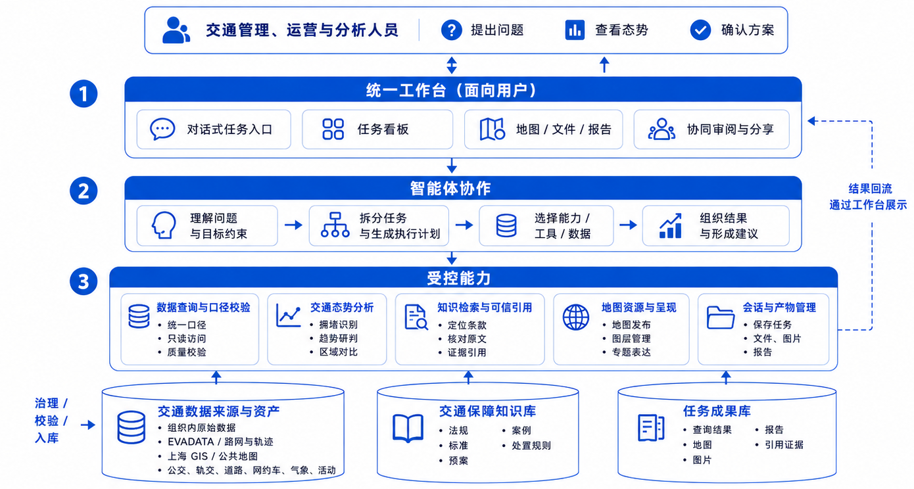

# 重大活动交通态势洞察及辅助决策智能体集群

> 外部汇报版 · v2.14.0

| 项目 | 内容 |
|---|---|
| 系统名称 | 交通态势智能工作台 |
| 案例对象 | 2025 年 8 月上海体育场重大活动 |
| 编制日期 | 2026 年 7 月 30 日 |

本汇报版本面向外部读者，章节结构与内部说明报告对齐。业务场景截图集中在"七、结果展示"，便于读者直观核查效果；技术实现细节请参阅内部说明报告。

## 一、总体概述

### 1.1 建设目标与定位

本项目服务重大活动交通态势研判和保障决策。业务人员用自然语言提出问题，工作台查询授权范围内的数据，完成对比、制图和报告整理；每次任务保存数据来源、执行步骤和结果文件，复核时可以沿原路径回查。系统用于分析辅助，指挥和审批仍由交通管理部门负责。

### 1.2 场景描述与能力边界

当前版本面向演唱会、体育赛事、大型集会等短周期、跨方式交通保障任务，覆盖五类业务能力：交通问数、空间分析、辅助研判、知识检索与引用、成果交付。

### 1.3 核心成果亮点概述

系统围绕交通保障业务，重点在五个方面构建能力：在工作台内一站式开展分析；统一理解公交、轨交、道路、网约车、气象等多源数据；直观呈现活动周边态势；为研判和方案提供可引用的依据；保留完整的分析过程以便复核。

## 二、总体技术架构

### 2.1 总体架构设计

系统围绕"提出问题、查看态势、研判方案"组织能力，由统一工作台、能力 harness、受控能力和支撑资源四个部分组成。业务人员通过一个入口完成提问、任务跟踪、地图查看和成果确认；Agent 根据任务调用数据、知识和分析工具；分析结果返回工作台后可继续追问或确认方案。

*图 1　总体架构（工作台 / 能力 harness / 受控能力 / 支撑资源）*

### 2.2 分层模块说明

工作台承接业务人员的所有交互；能力 harness 围绕当前任务调用问题理解、任务规划、数据查询、知识检索等能力；受控能力层把操作转化为明确的查询、分析和发布动作，数据库只读、地图命令与文件路径受规则约束；支撑资源由交通数据、交通保障知识库和任务成果组成。

### 2.3 核心技术选型

智能体运行时采用支持工具调用与任务步骤管理的 Coding Agent；服务端使用 Node.js 与 TypeScript，前端采用 React 19 与 Vite 8；地图采用 MapLibre GL 与 GeoScene 通过结构化命令更新图层；数据存储使用 SQLite 分域库配合 Python 治理脚本。整套技术栈便于本地部署、离线演示与版本迭代。

## 三、数据接入与治理

### 3.1 基础数据

组织方提供的核心业务数据包括网约车订单（含场馆关联的到场和离场订单）、公交客流、轨交客流、道路状态事件和气象观测，整体覆盖约 21—22 天的活动窗口，所有业务时间按 Asia/Shanghai 解释。

### 3.2 外部接入与项目补充数据

系统接入 EVDATA 新能源汽车数据服务获取实时路况；项目自行完成上海 GIS 与公开地图的采集和标准化，统一轨交、公交与道路的坐标和站序；时间维度由业务时间戳派生并对齐到分钟、15 分钟、小时和日；交通保障知识库收录法规、预案、案例与项目资料。

### 3.3 数据处理方式

数据处理围绕统一时间、统一坐标、订单去重与质量断言展开。不同坐标系的输入统一转换为 WGS84；订单按原始订单号 SHA-256 合并为唯一订单；事实与集市从标准层派生，问数优先查询集市；默认输出聚合数据，敏感字段受规则约束。

## 四、核心功能设计

本系统围绕一个 LLM Agent 构建能力 harness，Agent 在同一会话内按需调用智能问数、辅助决策、任务控制、数据治理与查询、知识检索与引用、地理可视化和报告与产物管理等能力。能力由项目级 Skill、Extension 工具和共享契约约束，工作台按会话隔离任务目录、状态和地图资源。

### 4.1 智能问数能力

智能问数能力包含语义解释、资产发现、受控查询、结果校验和结果表达。Agent 识别问题中的交通方式、实体、时间范围、空间范围和指标单位；订单与事件、站点与线路、活动日与演出时段等口径存在歧义时发起结构化询问。查询使用只读语句，校验对象名与返回行数，结果附带原始 SQL 与图表脚本，可在会话目录复核。

### 4.2 辅助决策能力

辅助决策能力基于问数结果与知识检索结果联合推理。复杂任务拆分为 2—8 个可检查步骤，分别对应演前、演出中与散场阶段；每步产出可核对的证据，方案按态势摘要、证据与判断、建议措施、执行条件、风险与待确认事项组织。道路管制、轨交限流、停运、警力部署等措施由相应责任部门确认。

### 4.3 配套能力

任务控制、数据治理与查询、知识检索与引用、地理可视化和报告与产物管理等配套能力由 Agent 按任务需要调用，确保复杂分析任务可以被分解、跟踪、归档与复用。

### 4.4 可解释性与可追溯设计

可解释性与可追溯围绕六个维度展开：过程可见、状态可恢复、数据可追溯、引用可核查、产物可复查、错误可诊断。研判结论附带原文引用，可从结论回溯到证据、引用条目和法规预案原文。

## 五、系统交互与成果呈现设计

### 5.1 对话交互系统设计

工作台以交通任务为入口，提供"新建交通任务"主操作，并将交通问数、地图分析和报告生成作为三类典型工作路径展示。进入任务后，地图、文件工作区和对话区并行显示；任务模式开启后，看板显示查询口径确认、数据提取、地图发布和结论整理等步骤；信息不足时，Agent 发起结构化询问。

*图 2　交通任务首页*

### 5.2 结果呈现设计

结果按照用途分别呈现：结论和依据留在对话区，步骤状态进入任务看板，空间结果进入地图，代码、表格、图片和报告进入文件工作区。地图与对话可以同屏联动，图层名称、统计口径和结果表格保持可见；Markdown 报告支持在线预览和 PDF 导出。

## 六、可拓展性与安全合规设计

### 6.1 系统可拓展性设计

系统通过分域数据、项目级 Skill 和共享契约承担扩展接口。接入新活动或数据源时，开发人员补充源数据登记、标准字段、质量规则、分域事实或集市以及参考文档，工作台主体保持不变。模型升级、能力升级和规模升级分别通过 RuntimeCapabilities、版本化 Bridge 与按需引入 MVT/PMTiles 实现。

### 6.2 数据安全与合规设计

- **数据最小化。** 原始文件和数据库通过受控数据包管理，查询资产只保留分析所需字段。
- **查询权限。** 数据库使用只读模式，并限制 SQL 类型、对象名称和返回行数。
- **隐私保护。** 订单号经过 SHA-256 假名化，默认输出聚合结果。
- **空间合规。** 发布数据只使用 EPSG:4326 或标记为未知的坐标。
- **引用校验。** 知识和任务产物登记真实路径及哈希，原件缺失时显示异常状态。

> [!WARNING]
> 道路管制、轨交限流、停运、警力部署、响应等级和对外发布由相应责任部门按职责核实并按法定程序审批；本系统提供分析材料和建议，不替代业务决策。

## 七、结果展示

### 7.1 核心能力量化测试结果

工程层面 70 项自动化测试全部通过，覆盖会话、鉴权、任务、地图和引用；浏览器冒烟在桌面端和移动端均通过；数据层面错误级质量规则全部通过，知识库索引覆盖 38 份文档、3,828 个节点、3,363 条知识项。业务问数准确率与方案采纳率需要通过独立盲测确定。

### 7.2 业务场景效果验证

围绕上海体育场四场演唱会，系统在同一任务内完成了以下业务验证。

*图 3　场馆 5 km 范围轨交保障图与四场活动日客流 TOP5*

*图 4　散场网约车下车热点、重要场站与轨交线路叠加分析*

*图 5　同一会话内的报告预览与导出*

*图 6　引用清单与法规、预案原文定位*

围绕同一份任务，业务人员可以在对话中查看结论、在地图上核查分布、在任务看板中追溯步骤、在文件工作区打开报告与引用，所有数据来源、操作命令和图表脚本一并保存。

### 7.3 已知缺陷与边界说明

- **数据时间跨度：** 各事实域约 21—22 天，适用于活动期短周期对比。
- **空间覆盖：** 轨交客流覆盖 10 个物理站；EVDATA 已入库 2025-08-24 单日样本；天气网格坐标系待确认。
- **部署范围：** 当前版本适合本机或受控演示，多用户和局域网部署需要增加认证、授权、审计与配额。

## 八、成果交付清单

### 8.1 文档类交付物

- **项目建设说明报告（内部版）：** 完整说明项目建设内容、技术架构、数据治理、核心功能、可拓展性、安全合规、结果展示与已知缺陷。
- **系统架构说明：** 记录系统边界、依赖方向和各模块职责。
- **数据资产说明与审查记录：** 说明数据覆盖、字段结构、指标口径、空间信息和治理结果。
- **版本变更记录：** 记录版本演进与验证结果。

### 8.2 系统类交付物

- 交通态势智能工作台源码与构建脚本。
- Task Mode、Geo Visualization、Citation、Web Bridge 等扩展组件。
- 数据资产、地图绘制、知识检索等 Skill。
- 受控数据安装包（6 个 SQLite 分域库及治理脚本）。

### 8.3 其他配套交付物

仓库提供工作台首页、设置、命令面板、移动端和交通地图分析截图，可直接用于汇报；演示视频可按"新建交通任务—开启任务模式—完成问数—生成地图—导出报告"的路径录制。