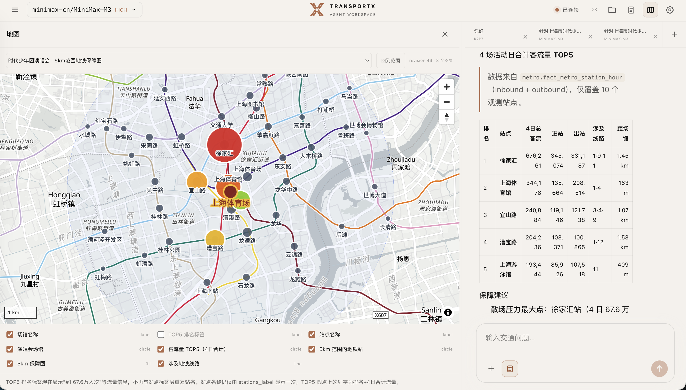
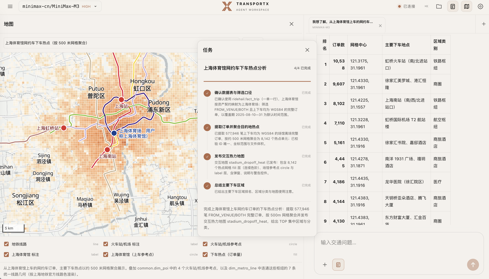
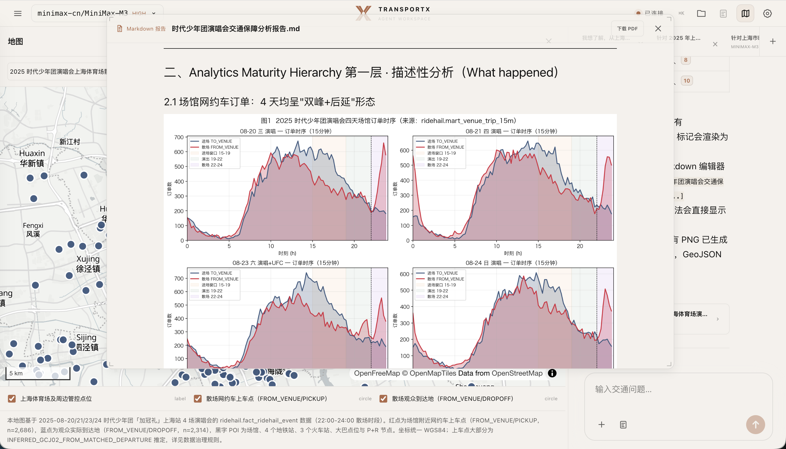
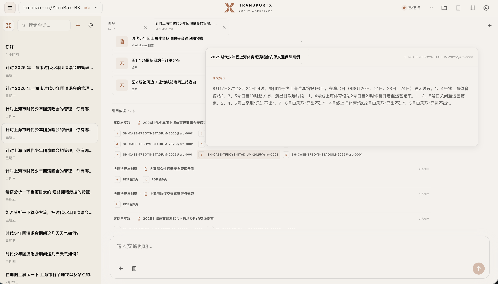

# 重大活动交通态势洞察及辅助决策智能体集群

> 项目建设说明报告

| 项目 | 内容 |
|---|---|
| 系统名称 | 交通态势智能工作台 |
| 当前版本 | v2.14.0 |
| 案例对象 | 2025 年 8 月上海体育场重大活动 |
| 编制日期 | 2026 年 7 月 30 日 |
| 文档状态 | 完善稿，以本 Markdown 文件为准 |

本报告依据仓库实现、数据资产说明、知识库索引和自动化测试结果编制。工程测试用于核查系统功能与安全边界。问数准确率和方案采纳率需单独开展业务验收。

## 摘要

重大活动交通保障数据分散在多个文件和系统中，各类数据的统计口径也有差异。分析人员完成一次研判，通常需要在数据库、制图工具和报告之间多次转录。本项目为此开发了浏览器端智能体工作台，将数据治理、外部数据接入、知识检索、交通问数、任务编排、地图和报告放在同一套系统中。当前案例选取上海体育场四场演唱会，使用公交、轨交、道路、网约车和气象数据，并接入 EVDATA 新能源汽车数据服务获取道路速度和实时路况。

项目名称中的“智能体集群”指由同一智能体统一调用的能力集合。智能体根据任务使用数据问数、决策辅助、任务控制、知识检索、地图呈现和报告生成等能力。各项能力由明确的工具与 Skill 约束，数据库权限、文件范围、地图渲染和引用来源由程序控制。

## 目录

- [一、总体概述](#一总体概述)
  - [1.1 建设目标与定位](#11-建设目标与定位)
  - [1.2 场景描述与能力边界](#12-场景描述与能力边界)
  - [1.3 核心成果亮点概述](#13-核心成果亮点概述)
- [二、总体技术架构](#二总体技术架构)
  - [2.1 总体架构设计](#21-总体架构设计)
  - [2.2 分层模块说明](#22-分层模块说明)
  - [2.3 核心技术选型清单](#23-核心技术选型清单)
- [三、数据接入与治理](#三数据接入与治理)
  - [3.1 基础数据](#31-基础数据)
  - [3.2 外部接入与项目补充数据](#32-外部接入与项目补充数据)
  - [3.3 数据处理方式](#33-数据处理方式)
- [四、核心功能设计](#四核心功能设计)
  - [4.1 智能问数能力](#41-智能问数能力)
  - [4.2 辅助决策能力](#42-辅助决策能力)
  - [4.3 配套能力](#43-配套能力)
  - [4.4 可解释性与可追溯设计](#44-可解释性与可追溯设计)
- [五、系统交互与成果呈现设计](#五系统交互与成果呈现设计)
  - [5.1 对话交互系统设计](#51-对话交互系统设计)
  - [5.2 结果呈现设计](#52-结果呈现设计)
- [六、可拓展性与安全合规设计](#六可拓展性与安全合规设计)
  - [6.1 系统可拓展性设计](#61-系统可拓展性设计)
  - [6.2 数据安全与合规设计](#62-数据安全与合规设计)
- [七、结果展示](#七结果展示)
  - [7.1 核心能力量化测试结果](#71-核心能力量化测试结果)
  - [7.2 业务场景效果验证](#72-业务场景效果验证)
  - [7.3 已知缺陷与边界说明](#73-已知缺陷与边界说明)
- [八、成果交付清单](#八成果交付清单)
  - [8.1 文档类交付物](#81-文档类交付物)
  - [8.2 系统类交付物](#82-系统类交付物)
  - [8.3 其他配套交付物](#83-其他配套交付物)

# 一、总体概述

## 1.1 建设目标与定位

本项目服务重大活动交通态势研判和保障决策。业务人员用自然语言提出问题，工作台查询授权范围内的数据，完成对比、制图和报告整理。每次任务保存数据来源、执行步骤和结果文件，复核时可以沿原路径回查。

系统用于分析辅助，指挥和审批仍由交通管理部门负责。活动前，业务人员可识别重点时段、站点和交通方式；活动期间，可查看已有数据反映的趋势和空间分布；活动结束后，可对比活动日与对照日，并保存查询和报告。

项目统一订单、端点、客流和道路状态的统计口径。系统以结构化数据保存查询过程、任务状态、地图场景和引用记录，分析结果可直接写入地图、表格和报告。

## 1.2 场景描述与能力边界

当前版本处理四类常见问题。原始数据分散在不同文件和坐标系中，同一订单容易重复统计；公交交易数、轨交人次、订单数和端点事件经常混用；查询、制图和报告之间存在重复转录；法规、预案和案例依据缺少稳定的引用位置。项目分别建立统一数据资产、只读查询接口、声明式地图和知识 ID。

当前版本覆盖五类业务场景。交通问数支持按日期、时段、线路、站点、道路发布段、订单方向等条件查询，并进行活动日与非活动日对比。空间分析发布经校验的 GeoJSON，绘制场馆、轨交网络、客流热点和重要枢纽，支持图层增量更新与选择交互。辅助研判按演前集结、演出中运行和散场疏散三个阶段整理证据，列出风险点、建议动作和待确认事项。知识检索与引用从法规、标准、预案、案例和项目资料中定位原文节点，登记可核查引用。成果交付则在同一会话中预览代码、表格、图片和 Markdown 报告，并将报告导出为 PDF。

## 1.3 核心成果亮点概述

系统围绕交通保障业务，重点在五个方面构建能力。

在工作台内一站式开展交通分析。业务人员用自然语言提出问题即可在同一界面完成数据查询、任务跟踪、地图分析和报告整理，不再需要在数据库、制图工具和报告之间反复切换。

统一理解多源交通数据。公交、轨交、道路、网约车、气象和空间信息在时间、位置和统计口径上对齐，让不同来源的数据可以放在同一坐标系下对照，避免跨域比较时口径不一致。

直观呈现活动周边态势。客流变化、交通热点、轨交站点和重点场所直接落到地图上，便于快速识别重点时段和重点区域，也让分析结果可以通过图层显隐和叠加控制逐项核查。

为研判和方案提供依据。数据分析结果与法规、预案、标准和同类案例结合，生成建议时同步保留出处；业务人员在采纳前可以沿着引用条目回到原文核对，避免“黑盒推荐”。

保留完整的分析过程。每次任务使用的数据、步骤、地图和报告都保存在会话目录中，业务人员既能恢复历史任务，也能沿原过程复核结论。

# 二、总体技术架构

## 2.1 总体架构设计

系统面向交通管理、运营和分析人员，围绕“提出问题、查看态势、研判方案”组织能力。整体架构由统一工作台、智能体能力协同、受控能力和支撑资源四个部分组成。业务人员通过一个入口完成提问、任务跟踪、地图查看和成果确认，智能体根据任务调用数据、知识和分析工具。

> 产品界面截图由发布文档构建流程按需注入，不引用开发者本机文件。

*图 1　重大活动交通态势洞察及辅助决策智能体集群总体架构*

图中自上而下展示了完整工作路径。图中的“智能体协作”表示同一智能体内部的多种能力协同。工作台承接业务人员的操作，智能体负责理解问题和组织任务，受控能力完成查询、分析、引用和成果管理，底层资源提供交通数据、保障知识和任务文件。分析结果返回工作台后，业务人员可以继续追问、调整任务或确认方案。

## 2.2 分层模块说明

### 2.2.1 统一工作台

统一工作台是业务人员使用系统的入口，集中承载对话、任务看板、地图、文件和报告。用户可以在同一界面提出交通问题、查看处理进度、核对空间分布并整理成果。不同会话和任务分别保存，历史分析可以恢复和继续。

### 2.2.2 智能体能力协同

智能体能力协同层负责把业务问题转化为可执行任务。同一智能体围绕当前任务按需调用四类能力：先做问题理解与口径确认，识别活动、日期、时段、区域、交通方式和指标，发现歧义时向用户确认；再进入任务规划与过程管理，把复杂问题拆分为可检查的步骤并跟踪执行进度、保留中间结果；然后通过数据查询与态势分析比较不同日期、时段、区域和交通方式，识别趋势、热点和异常；最后结合法规、预案、标准和案例完成知识检索与辅助研判，整理风险、建议措施和待确认事项。这些能力共享同一任务上下文，按分析需要依次调用，状态、数据结果和地图资源按会话隔离。

### 2.2.3 受控能力

受控能力层负责执行具体操作。数据查询按照已登记的表、字段和指标口径运行；态势分析使用统一的时间和空间规则；知识检索保留文档、条款和原件位置；地图展示只接收经过校验的空间数据；文件和报告按任务目录保存。

这一层把智能体提出的操作转化为明确的查询、分析和发布动作。数据库保持只读，地图命令、文件路径和引用来源均受规则约束，任务过程可以检查和回放。

### 2.2.4 支撑资源

底层资源分为三类。交通数据来源与资产涵盖组织方原始数据、EVDATA 道路数据、上海 GIS 与公开地图补充信息，以及治理形成的公交、轨交、道路、网约车和气象数据资产。交通保障知识库汇集法规、标准、预案、案例和项目资料，为措施研判和报告引用提供依据。任务成果包括查询结果、地图、图片、引用和报告，随任务保存在工作台目录，可供查看、下载和复核。

## 2.3 核心技术选型清单

- **智能体运行：**采用 Coding Agent 0.80.10，模型可配置，支持工具调用、会话恢复和任务步骤管理。

- **服务端：**采用 Node.js、TypeScript 和 WebSocket，负责运行时进程、会话状态和受控资源管理。

- **前端工作台：**采用 React 19、Vite 8、Tailwind CSS 4 和 Radix Dialog，支持对话、任务看板、地图、文件和报告的响应式展示。

- **地图呈现：**采用 MapLibre GL 5.24 和 GeoScene v1，通过结构化命令更新图层、样式和视角。

- **内容呈现：**采用 Markdown、Mermaid、KaTeX、Shiki 和 XLSX，支持报告、流程图、公式、代码和数据文件预览。

- **数据存储与治理：**采用 6 个 SQLite 分域库和 Python 3.10 脚本，管理组织方原始数据、EVDATA 道路数据及上海 GIS 与公开地图补充信息。

- **质量验证：**采用 node:test、Playwright 及模拟和真实运行时冒烟测试，检查会话、任务、地图、引用和浏览器交互。

# 三、数据接入与治理

## 3.1 基础数据

组织方提供的原始业务数据位于 `data/徐汇区各业态数据`，共 9 个文件，其中 CSV 7 个、XLSX 2 个。Excel 工作表拆分后登记为 12 个逻辑数据集，共 2,524,322 条源记录。GIS 静态网络、EVDATA 数据、POI、活动日程、时间维度和治理派生表由项目后续补充。原始文件保存在外部受控目录，项目仓库只保存代码、说明和知识资产。所有业务时间按 `Asia/Shanghai` 解释。

网约车订单包含上车端点 641,134 行、下车端点 634,446 行，记录订单号、时间、经纬度和坐标系信息，用于订单趋势、OD 和空间热点分析；其中与场馆关联的离场订单约 57.9 万行、到场订单约 57.2 万行，用于补齐行程并识别场馆出入方向。公交数据由 55,339 条半小时客流记录和 75 条有客流线路构成，叠加 77 条官方线路、194 个官方站点和 652 条站序关系，客流用于线路趋势和活动日对比，静态数据用于实体匹配。轨交客流共 7,975 条线路—站点—小时记录，覆盖 10 个物理站，记录进出站人次用于站点和高峰时段分析。道路状态由 21,775 条“逢变更新”事件组成，覆盖 89 个发布段，用于还原各状态的持续时间。气象观测共 11,384 条记录，覆盖徐汇区 8 个网格，温度和降雨信息以分钟粒度提供；网格坐标系尚未确认，当前按网格名称和小时关联。

## 3.2 外部接入与项目补充数据

3.1 列明的 9 个文件由组织方提供。其余数据来自外部接口、上海 GIS/公开地图资料、用户确认或程序派生，来源在资产目录中单独登记。这些数据补充道路动态、空间坐标、交通网络和分析所需的时空维度。

EVDATA 新能源汽车道路数据已通过接口接入，可获取实时路况；当前入库样本为 2025 年 8 月 24 日的 207 个 WGS84 路段和 14,977 条 15 分钟速度记录，用于道路速度趋势和空间分析；EVDATA 路段与组织方提供的 89 个发布段采用不同编号，当前分别查询。上海 GIS 与公开地图数据由项目自行采集、匹配和标准化，补充 20 条统一轨交线路、420 个物理站、46 条方向或支线路径、151 条公交方向线路和 1,078 个公交站点；已知 GCJ-02 等坐标统一转换为 WGS84，供地图展示、距离分析和客流实体匹配使用。时间维度由业务时间戳派生日期、分钟、15 分钟时段和小时字段，按 `Asia/Shanghai` 解释，用于跨数据域对齐。上海体育场和 4 个重要交通枢纽的坐标经用户确认，统一按 EPSG:4326 用于缓冲区、距离判断和地图标注。案例覆盖 2025 年 8 月 20、21、23、24 日的活动，19:00—22:00 为分析窗口。交通保障知识库当前验收 38 份文档、3,828 个节点和 3,363 条知识项，覆盖法规、标准、预案、案例和项目资料，用于检索条款、引用依据和约束方案。

## 3.3 数据处理方式

1.  来源分级与登记：先区分组织方原始数据、外部接口数据、项目空间补全和程序派生数据，再读取文件结构、行数、日期范围和字段类型，登记来源、哈希、覆盖范围与血缘。

2.  外部数据接入：EVDATA 道路 GeoJSON 与速度 CSV 经过 CRS、字段、路段 ID、15 分钟对齐和复合主键校验后独立入库；接口后续实时更新沿用同一契约。

3.  字段标准化：统一 `date_key`、`minute_key`、`slot_15_start`、`hour` 等时间字段；数值去除千分位；实体使用统一 `line_id`、`station_id`、`order_hash` 和 `geo_key`。

4.  订单去重：四类订单来源按原始订单号的 SHA-256 哈希合并为 `std_trip`，一单一行；9 条来源冲突完整保留并加注标记。

5.  坐标治理：上海 GIS/公开地图补全的 GCJ-02 点线以及已知 BD-09、EPSG:32651 坐标统一转换为 WGS84；场馆端点优先按订单回连证据继承 CRS；未知记录保留但禁用精确空间分析。

6.  事实与集市：从标准层派生订单、端点、场馆事件和 EVDATA 道路速度事实，再生成 15 分钟、小时和日集市；问数优先查询集市。

7.  质量断言：检查唯一性、坐标范围、集市加和恒等式、发布 CRS、时间范围、EVDATA 路段覆盖和错误级质量规则；当前错误级规则全部通过。

8.  隐私控制：资产库使用订单号的 SHA-256 哈希；地点文本按敏感字段管理；默认结果采用聚合数据；原始数据与生成数据库通过受控安装包管理。

### 资产化结果与质量状态

治理结果已形成 6 个分域 SQLite 数据库，当前受控数据包约 527 MB，包含标准层、事实层和分域集市。下表规模取自当前数据版本，交付时应随数据包一并复核。

| **核心资产** | **当前规模** | **粒度/用途** |
|:---|:---|:---|
| `ridehail.std_trip` | 1,206,222 行 | 唯一订单标准层，一单一行 |
| `ridehail.fact_trip` | 1,206,193 行 | 有效订单事实，支持 OD 和行程时长 |
| `ridehail.fact_ridehail_event` | 2,269,148 个端点 | 上/下车端点与热点分析 |
| `ridehail.fact_venue_trip` | 1,054,805 行 | 场馆关联唯一订单 |
| `ridehail.fact_venue_event` | 1,150,668 行 | 场馆到场/离场事件 |
| `road.dim_evdata_road_segment` | 207 行 | EVDATA WGS84 道路路段与地图几何 |
| `road.fact_evdata_road_speed_15m` | 14,977 行 | 2025-08-24 路段—15 分钟速度样本 |
| 分域集市 | 15 分钟/小时/日 | 趋势查询与跨域对齐 |

质量规则当前无错误级异常。保留的警告包括：1 个轨交物理站缺少 WGS84 坐标、1,684 个统一订单端点坐标系未知、29 个场馆关联订单坐标超出上海合理范围、9 个场馆来源订单存在核心字段冲突，以及 144 个 EVDATA 路段时槽不完整、12 条 `speed_avg` 高值记录。系统按规则保留、排除或标记这些记录，原值和处理过程可追溯。

# 四、核心功能设计

本系统围绕一个 LLM Agent 构建能力 harness，而非多个独立智能体的协同。Agent 在同一会话内按需调用智能问数、辅助决策、任务控制、数据治理与查询、知识检索与引用、地理可视化和报告与产物管理等能力。能力由项目级 Skill、Extension 工具和共享契约约束，工作台按会话隔离任务目录、状态和地图资源，确保数据范围、文件路径、地图命令和引用来源受到受控。

## 4.1 智能问数能力

智能问数能力包含语义解释、资产发现、受控查询、结果校验和结果表达。Agent 识别问题中的交通方式、实体、时间范围、空间范围和指标单位；订单与事件、站点与线路、活动日与演出时段等口径存在歧义时，发起结构化询问。

1.  **资产发现：** 读取 `coverage`、`business`、`order-sources` 和 `metrics` 等元数据，先确认可用日期、实体与指标，再选择表。

2.  **受控查询：** SQL 使用 `catalog`、`common`、`road`、`metro`、`bus`、`ridehail` 全限定对象名，优先查询已治理集市；执行只读语句，校验对象名并限制返回行数。

3.  **多表与复杂条件：** 以统一日期、线路、站点或订单键连接；跨域只在共同覆盖日期上比较；嵌套查询用于基准期、排名和差异计算。

4.  **校验纠错：** 核对结果行数、单位、时间粒度、求和关系和 CRS 状态；场馆事件与唯一订单分开统计；精确空间计算只使用已确认坐标系的记录。

5.  **结果表达：** 根据数据形态选择折线、分组柱状、差值、热力或地图；图表脚本与原始查询结果一同保存在任务目录。

6.  **异常处理：** 数据包缺失、对象不存在、覆盖不足或连续校验失败时，结束本次查询并列出缺少的数据。

## 4.2 辅助决策能力

辅助决策能力基于问数结果与知识检索结果联合推理。复杂任务拆分为 2—8 个可检查步骤：演前分析到场需求和公共交通承载，演出期间查看道路与站点运行，散场阶段分析离场波峰、接驳条件和交通方式衔接。

报告展示结论及其证据。每项判断列明所用事实或集市、比较日期、指标单位、端点口径和空间筛选条件；涉及法规或预案时，先筛选文档类别，再定位条款、原文节点和 PDF 页。方案按态势摘要、证据与判断、建议措施、执行条件、风险和待确认事项组织。道路管制、轨交限流、停运、警力部署、响应等级和对外发布由相应责任部门确认，系统只生成分析材料和建议。

## 4.3 配套能力

除智能问数与辅助决策外，配套能力由 Agent 按任务需要调用，工作台按会话隔离任务目录、状态和地图资源。任务控制负责创建与修订任务、更新步骤状态，在信息不足时发起结构化询问。数据治理与查询负责暴露数据资产与口径、提供受控只读查询。知识检索与引用负责定位法规、预案、案例条款，并登记可核查引用。地理可视化负责发布 GeoJSON 并增量构建地图，说明图层内容与空间口径。报告与产物管理负责整理文字、表格、图片和报告，管理任务产物。

## 4.4 可解释性与可追溯设计

可解释性与可追溯围绕六个维度展开。过程可见方面，对话中显示流式回复、思考阶段和工具时间线；工具卡完成后可折叠，但命令与结果仍可查看。状态可恢复方面，会话历史以 JSONL 和投影快照恢复；任务和地图使用版本号防止旧状态覆盖新状态。数据可追溯方面，目录库记录来源、覆盖、字段、指标、质量规则和构建信息，订单冲突与 CRS 推定保留标志。引用可核查方面，知识来源登记稳定 ID、页码/节点和原件哈希，原件缺失或变化时显示异常状态。产物可复查方面，SQL 结果、CSV/XLSX、图片、GeoJSON 和 Markdown 报告保存在会话目录，并由界面预览。错误可诊断方面，共享契约对未知版本、非法 revision、路径越界和不安全 Markdown 返回结构化错误。

# 五、系统交互与成果呈现设计

## 5.1 对话交互系统设计

工作台以交通任务为入口，对外界面使用 **TRANSPORTX Agent Workspace** 品牌。首页以“从一个清晰的交通问题开始”为引导，集中提供“新建交通任务”主操作，并将交通问数、地图分析和报告生成作为三类典型工作路径展示。顶部栏统一放置模型选择、连接状态、快捷命令以及文件、报告、地图和设置入口，让用户在开始分析前即可确认运行环境和可用工作区。

*图 2　TRANSPORTX Agent Workspace 交通任务首页*

进入任务后，地图、文件工作区和对话区并行显示。用户可创建、搜索、切换、恢复和关闭会话，历史记录按最近对话时间排序，同一界面也可切换多个任务标签。任务模式开启后，看板显示查询口径确认、数据提取、地图发布和结论整理等步骤。信息不足时，智能体发起确认、单选、短文本或长文本询问；取消操作结束本次询问。

界面采用响应式布局。桌面端可以拖动对话与地图的分隔条，键盘可调节，双击恢复默认宽度；移动端将地图放入独立抽屉。输入框把附件、任务模式和发送操作收拢在同一工具栏，无文字和附件时禁用发送。

## 5.2 结果呈现设计

结果按照用途分别呈现：结论和依据留在对话区，步骤状态进入任务看板，空间结果进入地图，代码、表格、图片和报告进入文件工作区。地图与对话可以同屏联动，图层名称、统计口径和结果表格保持可见；任务看板可浮层展开，便于核对从数据筛选到成果发布的完整过程。Markdown 支持表格、公式、流程图、代码高亮和受控相对图片；报告可以在浏览器中覆盖预览并下载为 PDF。

*图 3　上海体育场 5 km 范围轨交保障图与四场活动日客流 TOP5*

轨交保障图以场馆为中心绘制 5 km 保障圈，叠加范围内站点、涉及线路和场馆标记，并在对话区同步给出四场活动日客流量 TOP5、进出站拆分、涉及线路和距场馆距离。图层面板允许分别控制场馆名称、保障圈、线路、站点和排名标记，便于从全局网络切换到重点站点核查。

*图 4　散场网约车下车热点、重要场站与轨交线路叠加分析*

网约车示例从场馆离场完整订单中提取下车端点，按约 500 m 网格聚合为热度图，并叠加上海体育场、火车站/机场参考点和相关轨交线路。任务看板同步记录数据表与筛选口径确认、订单提取与网格聚合、交互地图发布、主要下车区域总结四个步骤；右侧结果表给出热点网格排名、订单数、网格中心、主要下车地点和区域类别，使地图分布与统计结果可以相互校验。

*图 5　时代少年团演唱会交通保障分析报告预览*

Markdown 报告预览将 15 分钟粒度的进场、散场订单曲线与分析文字放在同一版面，同时保留地图和会话上下文。用户可在工作台内检查图表、正文和分页效果，确认后下载 PDF。

*图 6　交通保障案例的引用清单与原文定位*

引用区按知识类别和来源文档汇总本次报告实际使用的证据，并保留引用编号、知识 ID 和 PDF 页码。点击编号后，原文定位浮层直接展示对应段落，例如车站出入口调整、进出站组织等具体措施，从而支持“报告结论—引用条目—来源原文”的逐级复核。

地图数据先完成分析和校验，再发布到浏览器。`publish_geodata` 检查 GeoJSON 的路径、大小、要素数、坐标和 ID，`present_visualization` 执行白名单内的命令。浏览器复用同一 `visualizationId`，以增量方式添加图层或修改样式，并保留用户设置的图层显隐状态。

# 六、可拓展性与安全合规设计

## 6.1 系统可拓展性设计

分域数据、项目级 Skill 和共享契约承担扩展接口。接入新活动或数据源时，开发人员补充源数据登记、标准字段、质量规则、分域事实或集市以及参考文档，工作台主体保持不变。

1.  新数据接入：盘点源文件与许可证/使用范围 → 建立字段映射和 CRS/时区规则 → 写入标准层 → 生成事实与集市 → 运行质量断言 → 更新目录与 Skill。

2.  跨场景迁移：保留会话、任务、引用、地图和报告链路，替换活动维度、场馆 POI、数据资产和案例知识；不同项目继续使用独立任务目录。

3.  模型升级：RuntimeCapabilities 发布模型身份和 thinking 等能力；前端只读取共享契约。

4.  能力升级：新增工具通过 Extension 注册，通过版本化 Bridge 发布完整 Manifest；浏览器根据 capability 决定展示。

5.  规模升级：当前 GeoJSON 上限为 5 万要素/20 MiB；只有数据规模达到瓶颈时再引入 MVT/PMTiles 或独立检索服务。

SQLite 和模块化单体适合当前的数据规模、本地部署方式和交付周期，也便于离线演示。多用户、高并发或实时流数据场景需要重新评估数据库、任务队列、权限中心和地图切片方案。

## 6.2 数据安全与合规设计

- **数据最小化：**原始文件和数据库通过受控数据包管理，查询资产只保留分析所需字段。

- **查询权限：**数据库使用只读模式，并限制 SQL 类型、对象名称和返回行数，降低误写和批量导出风险。

- **隐私保护：**订单号经过 SHA-256 假名化，用于去重和关联；地点文本按敏感字段管理，默认输出聚合结果。

- **空间合规：**发布数据只使用 EPSG:4326 或标记为未知的坐标。精确空间分析只采用坐标系已经确认的记录，转换过程保留来源和质量状态。

- **会话隔离：**文件、空间数据和引用资源绑定任务会话，系统阻断跨会话读取和路径越界。

- **内容安全：**地图由结构化命令驱动，Markdown 和链接经过安全校验后再呈现。

- **访问控制：**系统通过签名 Cookie、同源 WebSocket 和资源鉴权控制访问，当前适用于本机或受控演示环境。

- **引用校验：**知识和任务产物登记真实路径及 SHA-256。原件缺失或内容变化时，界面显示异常状态。

# 七、结果展示

## 7.1 核心能力量化测试结果

本节记录自动化测试结果和可复核的资产规模。工程测试覆盖运行链路、协议和安全边界。业务问数准确率与方案采纳率另行验收。

| **验证项** | **结果** | **范围/说明** |
|:--:|:---|:---|
| 项目构建 | 通过 | 服务端、前端和地图模块 |
| 自动化测试 | 70/70 通过 | 会话、鉴权、任务、地图和引用 |
| 浏览器冒烟 | 通过 | 桌面端和移动端关键交互 |
| 数据质量规则 | 错误级全部通过 | 唯一性、坐标和集市加和关系 |
| 知识库索引 | 38 份文档 | 3,828 个节点、3,363 条知识项 |
| 业务准确率 | 待验收 | 需建立专家标注题集 |

下一阶段计划建立不少于 100 道分层问数题和 10—20 个完整保障场景，交由交通业务、数据和安全人员分别评分。问数题覆盖口径辨析、单表、多表、时间窗口、空间条件和异常输入。方案评估记录事实正确性、依据有效性、措施可执行性、风险遗漏和人工改写量。

## 7.2 业务场景效果验证

- **上海体育场周边轨交网络：**筛选场馆 5 km 范围内的站点，叠加线路、站点、场馆标签和活动日客流排名。验证内容包括坐标投影、线路颜色、站点数量、排名口径和图层可读性。

- **网约车需求热度：**按约 500 m 网格汇总下车端点，并叠加上海体育场、重要交通枢纽和轨交线路。结果使用聚合数据，同时说明热点口径和坐标状态。

- **活动日多方式趋势：**按照演前、演中和散场时段，对比网约车、公交、轨交、组织方道路状态和 EVDATA 道路速度。各交通方式分开标注单位，只比较共同覆盖日期。

- **知识辅助方案：**从法规、标准、预案和案例中定位相关条款，生成带来源的建议。引用内容按法律义务、标准要求、预案程序和案例经验分别说明。

- **报告交付：**将对话结论、引用、图片和数据文件汇总为 Markdown 报告，支持在线预览和 PDF 导出。参考依据只收录正文实际使用的来源。

现有演示已在同一任务中完成数据查询、空间叠加、过程说明和成果文件生成。当前验证结论为系统链路可运行、结果可复核。生产指挥准确率需通过独立业务盲测确定。

## 7.3 已知缺陷与边界说明

- 数据时间跨度：各事实域约 21—22 天，适用于活动期短周期对比。年度规律、节假日模型和长期预测需要补充长期数据。

- 空间覆盖：轨交客流覆盖 10 个物理站；原 89 个道路发布段没有几何；EVDATA 已入库 2025-08-24 的 207 个场馆周边路段样本，路段映射待建立；天气网格 CRS 待确认。

- 样本范围：订单、公交和道路数据以徐汇区及场馆相关样本为主，结论适用于当前样本范围。

- 业务验收：专家标注的问数题库和方案评分集待建立，准确率和采纳率将在盲测后填写。

- 部署范围：当前版本适合本机或受控演示。多人和局域网部署需要增加认证、授权、审计与配额。

- 数据库安装：Git checkout 包含代码、Skill、参考文档和脚本，交通数据库由受控安装包提供。查询功能在数据库安装后启用。

- 决策责任：交通管理、运营、公安和活动承办单位按职责核实并批准系统建议。

# 八、成果交付清单

## 8.1 文档类交付物

- **项目建设说明报告：**本文件，编制日期为 2026 年 7 月 30 日。报告说明项目建设内容和验收边界，后续更新以本文件为准。

- **[README.md](../../../../README.md)：**版本 v2.14.0，说明产品能力、启动方式、验证命令和运行约束。

- **[系统架构说明](../../../ARCHITECTURE.md)：**说明系统边界、依赖方向和各模块职责。

- **[可信引用技术方案](../CITATION_FEATURE_TECHNICAL_PLAN.md)：**记录引用机制、报告产物和验收情况。

- **[测试基线](../TEST_BASELINES.md)：**记录默认测试和浏览器验证范围。

- **[版本变更记录](../../../CHANGELOG.md)：**记录截至 v2.14 的版本演进和验证结果。

- **[数据资产说明](../skills/shanghai-traffic-data-assets-data-profile.md)与[审查记录](../skills/shanghai-traffic-data-assets-review.md)：**版本 3.1.0，说明数据覆盖、字段结构、指标口径、空间信息、EVDATA 接入和治理结果。

## 8.2 系统类交付物

- 交通态势智能工作台 v2.14.0 源码与构建脚本：Node/TypeScript 服务、React 工作台、浏览器 Kernel 和共享契约。

- Task Mode、Geo Visualization、Citation、Web Bridge 等扩展组件。

- shanghai-traffic-data-assets、search-traffic-assurance-knowledge、geo-visualization-explanation、plot-from-data 等项目级 Skill；结构化知识目录和原件由独立 Knowledge Module 提供，不与检索 Skill 捆绑。

- 自动化测试、浏览器冒烟、真实运行时 RPC 冒烟和测试夹具。

- 受控数据安装包：6 个 SQLite 分域库及查询/治理脚本；数据库与原始数据单独交付。

> [!TIP]
> 在项目目录执行 `npm install` 后运行 `./start.sh`，默认访问 `http://127.0.0.1:3000`。也可先执行 `npm run build`，再用 `node bin/tau.js --host 127.0.0.1 --port 3001 --open` 启动。服务使用当前用户权限。受控数据库、密钥和原始数据按部署环境单独配置。

## 8.3 其他配套交付物

仓库提供首页、设置、命令面板、移动端和交通地图分析截图，可直接用于汇报。地图示例包括上海体育场周边轨交网络、网约车热度与重要场站叠加。演示视频可按“新建交通任务—开启任务模式—完成问数—生成地图—导出报告”的路径录制。

交通数据库和组织方原始交通数据通过受控安装包交付。代码仓库可独立启动界面，安装数据库后开放数据查询。法规、标准、预案和案例的原件及结构化索引由独立 Knowledge Module 安装，运行时再与知识检索 Skill 装配。
